# 🗺️ הארכיטקטורה של Ghost — המדריך הוויזואלי

> מסמך זה מסביר **איך המערכת בנויה ומה קורה בכל רגע**, בשפה פשוטה ולא-טכנית.
> כל אחד — גם מי שלא מתכנת — אמור להבין מכאן את כל הסיפור, מקצה לקצה.

---

## 🎯 מה זו המערכת? — במשפט אחד

> **Ghost הוא "צופה לילה" חכם שיושב לידך, מסתכל יחד איתך על מצלמות האבטחה, ומספר לך במילים אנושיות מה הוא רואה — ואפילו זוכר מה ראה אתמול.**

אתה שואל אותו שאלות בצ'אט (בדיוק כמו צ'אט רגיל), הוא מסתכל על תמונה חיה מהמצלמה, ועונה לך.
הוא גם **שומר הכול אצלך במחשב** — אף אחד בחוץ לא רואה את המידע שלך.

---

## 🧩 מתוך מה המערכת מורכבת? — תמונת על

חשוב על המערכת כמו על **משרד עם שלושה חדרים** + יועץ חיצוני:

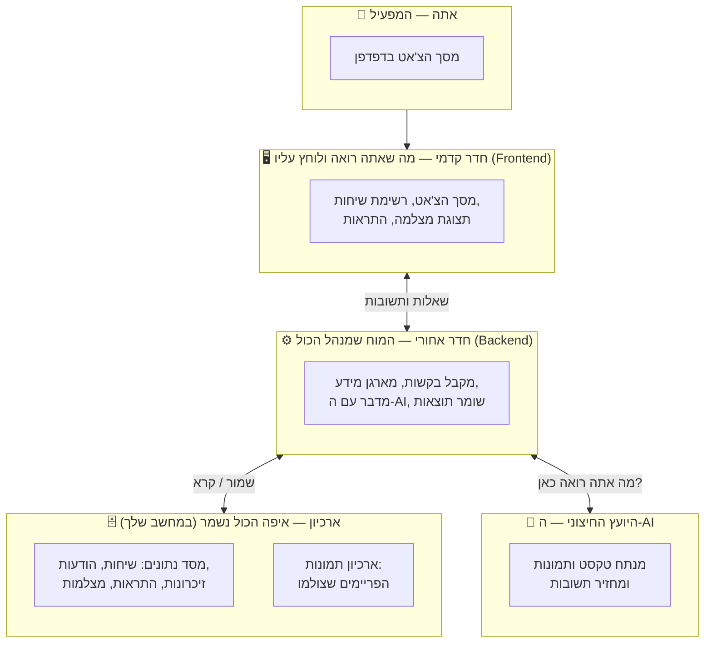

**הכלל הזהב:** המידע שלך **לא יוצא מהמחשב**. הדבר היחיד שיוצא החוצה הוא הטקסט/התמונה שנשלחים ליועץ החיצוני (ה-AI) כדי לקבל תשובה.

---

## 🏠 ארבעת החלקים — כל אחד בשפה פשוטה

### 1. 🖥️ החדר הקדמי — מה שאתה רואה (Frontend)

זה הדף בדפדפן. מה שיש בו:

| מה אתה רואה | מה זה עושה |
| --- | --- |
| **רשימת שיחות** מימין | כמו רשימת צ'אטים בוואטסאפ — כל שיחה נשמרת |
| **חלון הצ'אט** במרכז | פה אתה כותב ופה מופיעות התשובות, מילה-מילה בזמן אמת |
| **תצוגת מצלמה** | תמונה חיה מהמצלמה/מצלמות שחיברת לשיחה |
| **מצב התראה** | מתג שמפעיל "שמירה אוטומטית" — המערכת מסתכלת לבד ומתריעה |
| **פאנל זיכרון / ידע** | מראה מה Ghost "זוכר" ואיזה מסמכים העלית לו |

### 2. ⚙️ החדר האחורי — המוח (Backend)

זה החלק שאתה **לא** רואה, אבל הוא עושה את כל העבודה החכמה:

- מקבל את מה שכתבת
- אוסף את כל ההקשר הרלוונטי (מה דובר קודם, מה Ghost זוכר, מסמכים שהעלית, מה ראה במצלמות)
- בונה "תדריך" מסודר ושולח ל-AI
- מקבל את התשובה ומעביר לך אותה מילה-מילה
- שומר הכול בארכיון לפעם הבאה

### 3. 🗄️ הארכיון — איפה נשמר המידע (במחשב שלך)

- **מסד נתונים** — טבלאות מסודרות: משתמשים, שיחות, הודעות, זיכרונות, חוקי התראה, מצלמות, "ישויות" שראינו.
- **ארכיון וקטורי** — דרך חכמה לחפש "לפי משמעות" ולא לפי מילים מדויקות (כך Ghost מוצא זיכרון רלוונטי גם אם ניסחת אחרת).
- **תיקיית תמונות** — כל פריים שצולם מהמצלמה נשמר כקובץ תמונה.

### 4. 🧠 היועץ החיצוני — ה-AI

זה המומחה שמנתח. שולחים לו טקסט ו/או תמונה, והוא מחזיר תיאור או תשובה. יש לו שלושה "כובעים":

| כובע | מתי משתמשים בו |
| --- | --- |
| **המנתח הראשי** | לענות לך בצ'אט ולתאר מה רואים במצלמה |
| **העוזר המהיר והזול** | לחלץ זיכרונות, לזהות מי/מה בתמונה, לסרוק התראות |
| **המאנדקס** | להפוך טקסט ל"טביעת משמעות" כדי לאפשר חיפוש חכם |

---

## 🚶 המסע: מה קורה בכל פעולה — צעד אחר צעד

זה החלק שמסביר **"כל דבר שקורה בדרך"**. כל זרימה מוצגת כדיאגרמה.

### א. 🔑 כניסה למערכת

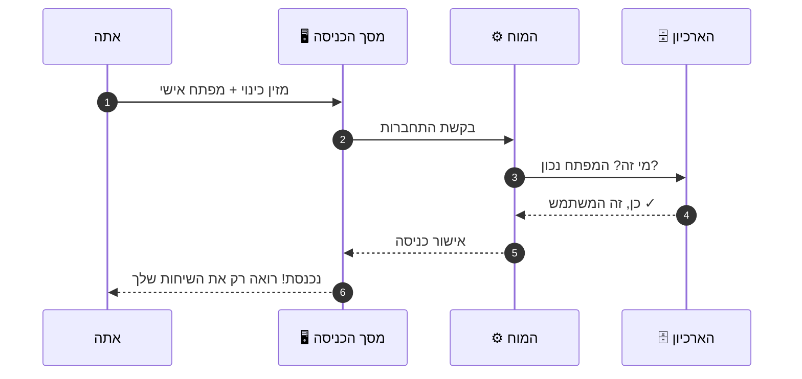

> 🔒 המפתח האישי שלך נשמר **מוצפן** — גם מי שיפתח את הארכיון לא יוכל לקרוא אותו.

---

### ב. 💬 שליחת הודעת טקסט רגילה

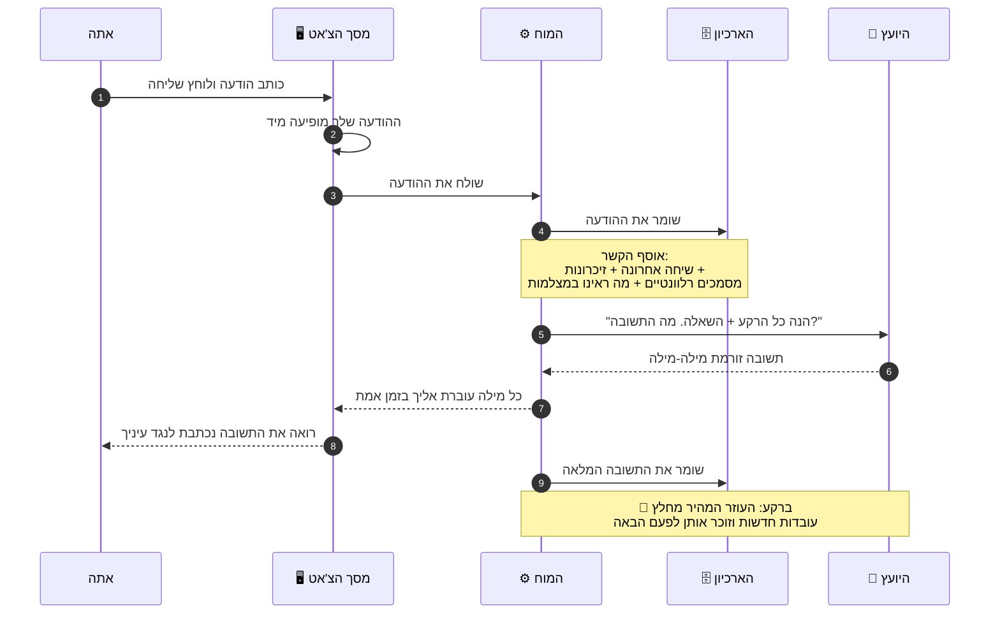

**מה חשוב כאן:** לפני שהשאלה נשלחת ל-AI, המוח **אורז עבורו תדריך מלא** — לא רק את השאלה, אלא גם את כל ההקשר. ככה התשובות נשמעות "מבינות" ולא מנותקות.

---

### ג. 📷 שליחת הודעה עם מבט מהמצלמה

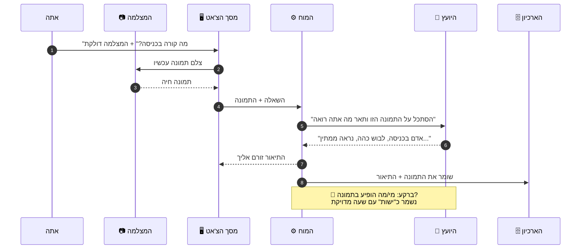

> כך נולד **הזיכרון החזותי** — לא רק "ראיתי אדם", אלא "ראיתי את האדם הזה ב-22:14 במצלמת הכניסה".

---

### ד. 📷📷 כמה מצלמות בבת אחת

אם חיברת לשיחה כמה מצלמות, הודעה אחת שלך מפעילה סבב על כולן:

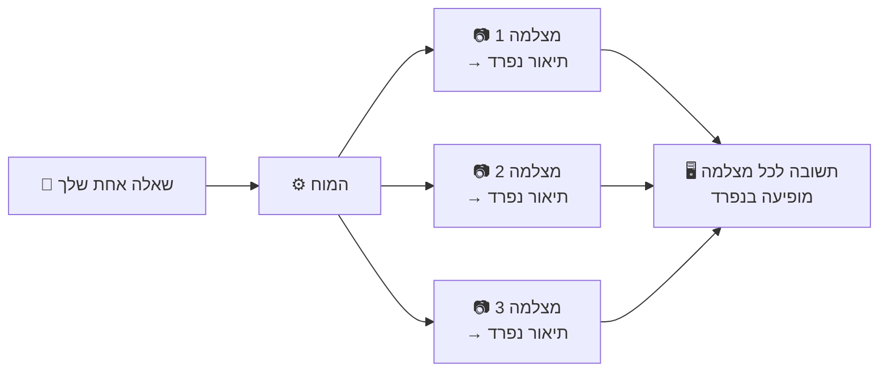

מקבלים תשובה **נפרדת וברורה לכל מצלמה**, אחת אחרי השנייה.

---

### ה. 🚨 מצב התראה — שמירה אוטומטית

זה הקסם הגדול: אתה לא צריך לשבת ולהסתכל. אתה אומר ל-Ghost **על מה להתריע** ("אדם עם נשק", "שריפה", "מישהו מטפס על הגדר"), ומדליק את המתג.

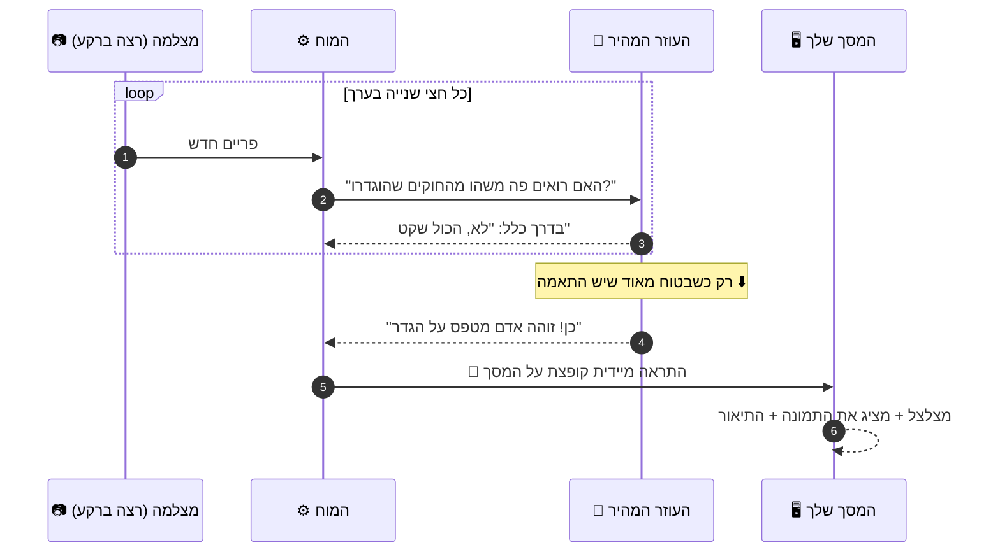

**שתי הגנות מובנות שמונעות התראות שווא:**
- 🎯 התראה נוצרת **רק כשה-AI בטוח מאוד** — לא על כל ספק.
- 🔁 המערכת לא שולחת אותה בדיקה פעמיים בו-זמנית.

---

### ו. ⏰ "מתי ראית את X?" — Ghost יודע להגיד שעה

בעבר AI היה עונה "אין לי יכולת לעקוב אחר זמנים". כאן זה פתור:

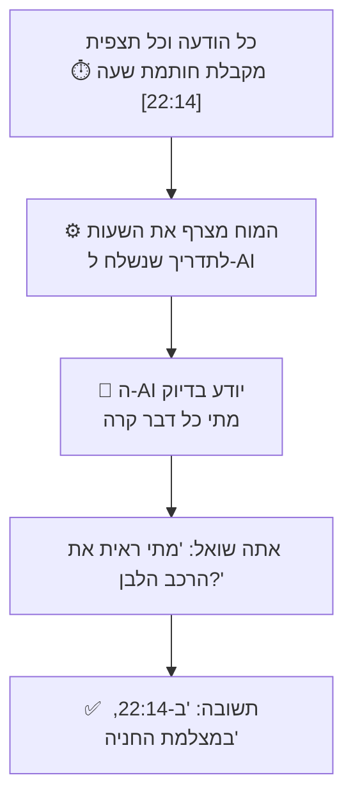

---

## 🧠 המנגנונים החכמים שמאחורי הקלעים

ארבעה "כוחות-על" שגורמים ל-Ghost להרגיש חכם באמת:

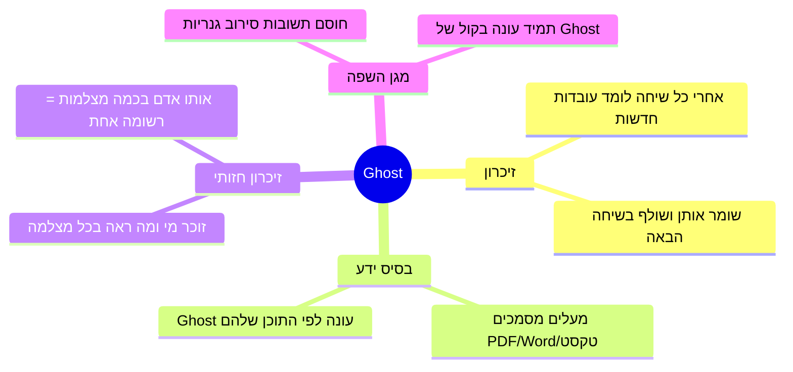

| הכוח | בשפה פשוטה |
| --- | --- |
| 🧠 **זיכרון** | אחרי כל שיחה, עוזר חכם מחלץ עובדות חשובות ושומר אותן. בפעם הבאה Ghost כבר "מכיר אותך". |
| 📚 **בסיס ידע** | מעלים מסמכים (נהלים, דוחות), Ghost חותך אותם לקטעים וזוכר. אחר כך עונה לפי מה שכתוב בהם. |
| 👁️ **זיכרון חזותי** | כל אדם/רכב שראינו במצלמה נשמר כ"ישות" עם שעה. אותו אדם שמופיע בכמה מצלמות מתאחד לרשומה אחת — כך אפשר לשאול "כמה אנשים שונים ראיתי הלילה?" ולקבל מספר מדויק. |
| 🛡️ **מגן השפה** | שתי שכבות שמוודאות שלעולם לא תקבל תשובת סירוב משעממת בנוסח "מצטער, אני לא יכול". במקום זה — הודעה ידידותית בקול של Ghost. |

---

## 🗄️ איפה כל פיסת מידע נשמרת?

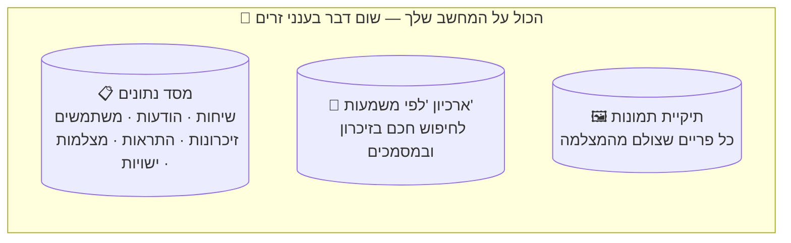

---

## 🔒 אבטחה ופרטיות — בקצרה

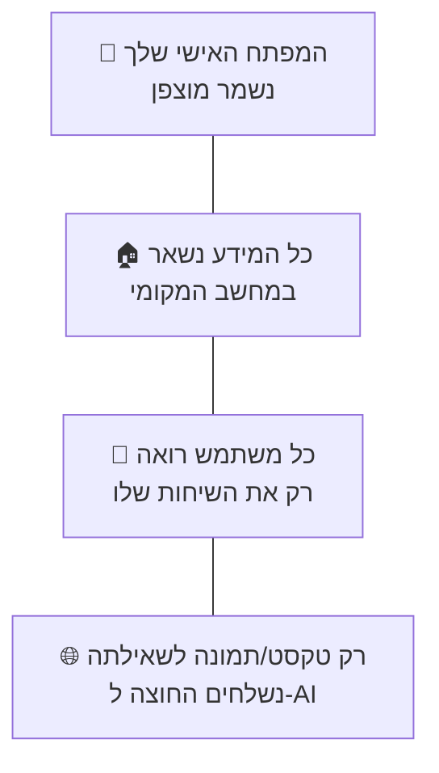

---

## 🧭 סיכום ויזואלי — כל הסיפור בתמונה אחת

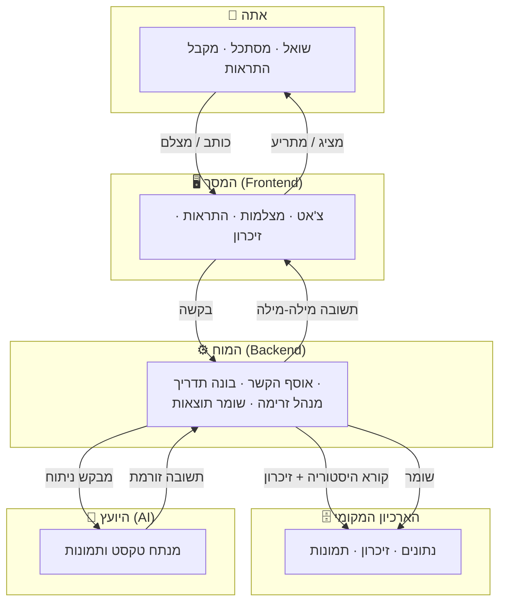

---

> **בשורה התחתונה:** אתה מדבר עם Ghost בצ'אט פשוט. מאחורי הקלעים, המוח אוסף את כל מה שצריך לדעת, מתייעץ עם ה-AI, זוכר מה שחשוב, שומר הכול אצלך בבית — ובמצב התראה אפילו שומר עליך לבד מסביב לשעון.
