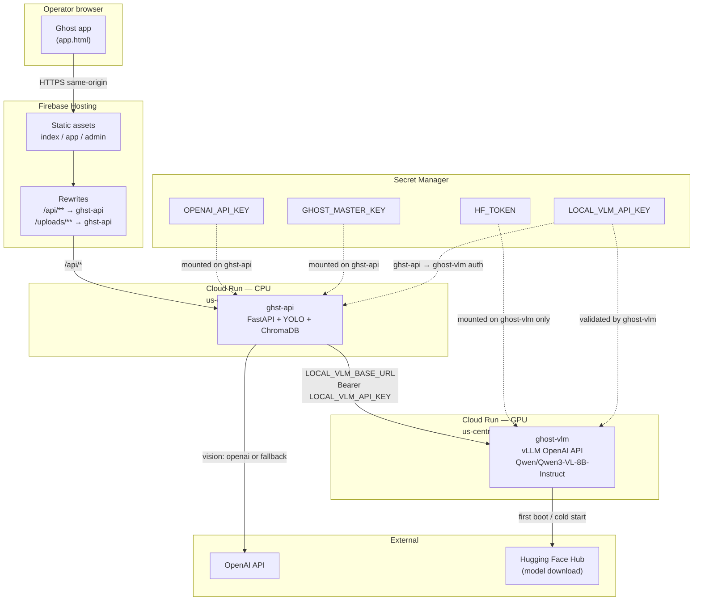

# Ghost cloud deployment

Production Ghost runs on **Firebase Hosting** (static frontend) with the **FastAPI backend** on **Cloud Run** (`ghst-api`). Vision workloads can optionally route to a **separate GPU Cloud Run service** (`ghost-vlm`) that serves an OpenAI-compatible VLM — model weights are **not** stored in this repository.

For local development and provider tuning, see [local-vlm.md](./local-vlm.md).

## Architecture



**Traffic path**

1. The browser loads the SPA from Firebase Hosting (`https://<project>.web.app`).
2. API calls go to `/api/**` on the same origin; Firebase rewrites them to the `ghst-api` Cloud Run service (see `firebase.json`).
3. When `LOCAL_VLM_ENABLED=true`, `ghst-api` forwards vision requests to `ghost-vlm` at `LOCAL_VLM_BASE_URL` (`POST /v1/chat/completions`).
4. If `GHOST_VISION_PROVIDER=auto` and the GPU service is down or slow, `ghst-api` falls back to OpenAI (requires `OPENAI_API_KEY` or a per-operator key).

**Why a separate `ghost-vlm` service**

- GPU images are large; keeping VLM out of `ghst-api` avoids rebuilding the torch/YOLO backend on every model change.
- Model weights download at container start from Hugging Face — **never commit weights to git**.
- Scale, memory, and cold-start policy can differ (GPU L4, long timeout, optional `min-instances`).

## Prerequisites

| Requirement | Notes |
| --- | --- |
| Firebase CLI | `firebase login` (project `ghst-ebb50` or your `PROJECT_ID`) |
| gcloud CLI | `gcloud auth login`, billing enabled (Blaze) |
| Secrets | `OPENAI_API_KEY`, `GHOST_MASTER_KEY`, `GHOST_DEMO_API_KEY`, `GHOST_ADMIN_TOKEN` for `ghst-api` |
| GPU quota | Cloud Run GPU (L4 recommended) in `us-central1` |
| Hugging Face | Account + `HF_TOKEN` with access to `Qwen/Qwen3-VL-8B-Instruct` (gated models need accepted license) |

## Step 1 — Deploy `ghst-api` (existing path)

The main backend deploy is handled by `scripts/deploy-firebase.sh`:

```bash
export OPENAI_API_KEY="sk-..."
export GHOST_DEMO_API_KEY="sk-..."
# optional: export GHOST_MASTER_KEY=... GHOST_ADMIN_TOKEN=... GHOST_GM_CODE=...
bash scripts/deploy-firebase.sh
```

This script:

1. Stores secrets in **Secret Manager** and mounts them on `ghst-api`.
2. Builds and deploys the backend to Cloud Run (`ghst-api`, 4 GiB CPU, persistent GCS volume for `/app/data`).
3. Builds the frontend and deploys **Firebase Hosting** with rewrites to `ghst-api`.

After deploy, verify:

```bash
curl -s "https://ghst-ebb50.web.app/api/health"
```

## Step 2 — Deploy `ghost-vlm` (GPU, separate service)

`ghost-vlm` is **not** part of the default Firebase deploy script. Provision it once (or when the VLM image/model changes).

### 2a. Store GPU-specific secrets

```bash
PROJECT_ID=ghst-ebb50
REGION=us-central1

# Hugging Face token — ghost-vlm only (model pull at startup)
printf '%s' "$HF_TOKEN" | gcloud secrets create HF_TOKEN --data-file=- --replication-policy=automatic \
  || printf '%s' "$HF_TOKEN" | gcloud secrets versions add HF_TOKEN --data-file=-

# Shared bearer token between ghst-api and ghost-vlm (generate a long random string)
LOCAL_VLM_API_KEY="$(python3 -c 'import secrets; print(secrets.token_urlsafe(48))')"
printf '%s' "$LOCAL_VLM_API_KEY" | gcloud secrets create LOCAL_VLM_API_KEY --data-file=- --replication-policy=automatic \
  || printf '%s' "$LOCAL_VLM_API_KEY" | gcloud secrets versions add LOCAL_VLM_API_KEY --data-file=-
```

Grant the Cloud Run runtime service account access:

```bash
PROJECT_NUM="$(gcloud projects describe "$PROJECT_ID" --format='value(projectNumber)')"
RUNTIME_SA="${PROJECT_NUM}-compute@developer.gserviceaccount.com"
for s in HF_TOKEN LOCAL_VLM_API_KEY; do
  gcloud secrets add-iam-policy-binding "$s" \
    --member="serviceAccount:${RUNTIME_SA}" \
    --role="roles/secretmanager.secretAccessor"
done
```

### 2b. Build and deploy the VLM container

Use a dedicated directory (for example `ghost-vlm/`) **outside** the main backend image. Illustrative Dockerfile — weights are pulled at runtime, not copied from git:

```dockerfile
FROM vllm/vllm-openai:latest

ENV MODEL=Qwen/Qwen3-VL-8B-Instruct
ENV HOST=0.0.0.0
ENV PORT=8080

# HF_TOKEN injected via Cloud Run --set-secrets
CMD ["sh", "-c", "vllm serve ${MODEL} --host ${HOST} --port ${PORT}"]
```

Deploy to Cloud Run with GPU:

```bash
gcloud run deploy ghost-vlm \
  --source ./ghost-vlm \
  --region "$REGION" \
  --platform managed \
  --gpu 1 \
  --gpu-type nvidia-l4 \
  --memory 24Gi \
  --cpu 4 \
  --timeout 900 \
  --concurrency 1 \
  --min-instances 0 \
  --max-instances 2 \
  --no-allow-unauthenticated \
  --set-secrets="HF_TOKEN=HF_TOKEN:latest" \
  --set-env-vars="HUGGING_FACE_HUB_TOKEN=${HF_TOKEN}"
```

Notes:

- **No weights in git** — vLLM downloads `Qwen/Qwen3-VL-8B-Instruct` on first start; allow several minutes and ensure `HF_TOKEN` is valid.
- Set `--min-instances 1` if cold starts are unacceptable (see [Troubleshooting](./local-vlm.md#troubleshooting)).
- Record the service URL, e.g. `https://ghost-vlm-xxxxxxxx-uc.a.run.app`.

### 2c. Wire `ghst-api` to `ghost-vlm`

Update the `ghst-api` Cloud Run service with local VLM env vars (add secrets/env to the existing deploy or `gcloud run services update`):

```bash
VLM_URL="https://ghost-vlm-xxxxxxxx-uc.a.run.app"

gcloud run services update ghst-api \
  --region "$REGION" \
  --update-env-vars="LOCAL_VLM_ENABLED=true,LOCAL_VLM_BASE_URL=${VLM_URL},LOCAL_VLM_MODEL=Qwen/Qwen3-VL-8B-Instruct,LOCAL_VLM_TIMEOUT_SECONDS=120,GHOST_VISION_PROVIDER=auto" \
  --update-secrets="LOCAL_VLM_API_KEY=LOCAL_VLM_API_KEY:latest"
```

`ghst-api` sends `Authorization: Bearer <LOCAL_VLM_API_KEY>` on each request to `ghost-vlm`. Configure the VLM container or a sidecar proxy to validate that token if the service is reachable beyond your VPC.

## Step 3 — Verify end-to-end

**Health** (via Hosting rewrite):

```bash
curl -s "https://ghst-ebb50.web.app/api/health"
```

**Local VLM diagnostic** (JSON body; replace `USER_ID` and base64 image):

```bash
IMG_B64="$(base64 -w0 /path/to/frame.jpg)"
curl -s -X POST "https://ghst-ebb50.web.app/api/vision/local-analyze" \
  -H "Content-Type: application/json" \
  -d "{
    \"user_id\": \"<USER_ID>\",
    \"image_base64\": \"${IMG_B64}\",
    \"prompt\": \"Describe people and vehicles in this scene.\",
    \"provider\": \"auto\"
  }"
```

A healthy GPU path returns `"provider": "local_vlm"` in `data`. If the GPU service fails and OpenAI is configured, `"provider": "openai"` indicates fallback.

## Environment variables (cloud)

| Variable | Service | Secret? | Description |
| --- | --- | --- | --- |
| `LOCAL_VLM_ENABLED` | `ghst-api` | no | `true` to enable routing to `ghost-vlm`. |
| `LOCAL_VLM_BASE_URL` | `ghst-api` | no | `ghost-vlm` Cloud Run URL (no trailing slash). |
| `LOCAL_VLM_MODEL` | `ghst-api` | no | `Qwen/Qwen3-VL-8B-Instruct` (must match vLLM serve arg). |
| `LOCAL_VLM_API_KEY` | `ghst-api` | **yes** | Bearer token sent to `ghost-vlm`. |
| `LOCAL_VLM_TIMEOUT_SECONDS` | `ghst-api` | no | Increase for cold starts (e.g. `120`–`300`). |
| `GHOST_VISION_PROVIDER` | `ghst-api` | no | `auto` recommended in production. |
| `HF_TOKEN` | `ghost-vlm` | **yes** | Hugging Face download auth; not used by `ghst-api`. |
| `OPENAI_API_KEY` | `ghst-api` | **yes** | Required for chat/embeddings; used when `auto` falls back. |

Copy-paste defaults: `backend/.env.example` and [local-vlm.md](./local-vlm.md#environment-variables).

## Operational checklist

- [ ] `ghst-api` healthy via `/api/health`
- [ ] `ghost-vlm` revision serving; GPU quota not exhausted
- [ ] `HF_TOKEN` valid and model license accepted on Hugging Face
- [ ] `LOCAL_VLM_BASE_URL` points at current `ghost-vlm` URL
- [ ] `LOCAL_VLM_API_KEY` matches on both services
- [ ] `GHOST_VISION_PROVIDER=auto` and `OPENAI_API_KEY` set for fallback
- [ ] First-request latency acceptable (or `min-instances ≥ 1` on `ghost-vlm`)

## See also

- [local-vlm.md](./local-vlm.md) — local vLLM setup, provider modes, troubleshooting
- [README.md](../README.md) — developer quick start
- `firebase.json` — Hosting rewrites to `ghst-api`
- `scripts/deploy-firebase.sh` — full `ghst-api` + Hosting deploy
