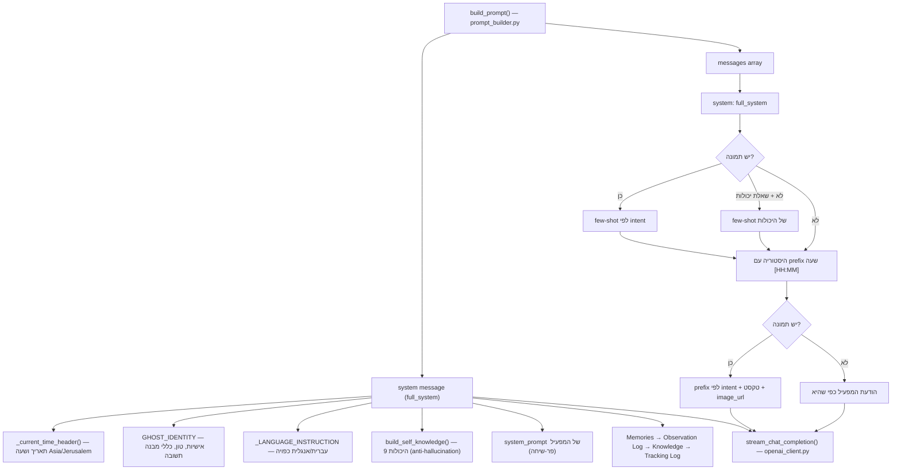

# מדריך המוח של Ghost — איך Ghost חושב, מדבר ושולח בקשות

> מסמך עריכה למפעיל. מסביר בשפה פשוטה **מי זה Ghost**, **איך נבנית כל בקשה שנשלחת ל-API של המודל**, ו**איזה פרמטר קטן לערוך** כדי לשנות כל דבר באופי, בטון, במבנה התשובה ובהתנהגות של Ghost — בכל ערוץ במערכת.
>
> לכל פריט במסמך תמצא ארבעה דברים: **מה זה / איפה בקוד / ברירת מחדל / מה לשנות כדי להשפיע**.
>
> המסמך הזה הוא תיעוד בלבד. הוא לא מריץ ולא משנה קוד — הוא רק מצביע לך איפה לגעת.

---

## תוכן עניינים

- [חלק 0 — מי זה Ghost ואיפה "המוח" חי](#part-0)
- [חלק 1 — האישיות והטון (הלב של "מי זה Ghost")](#part-1)
- [חלק 2 — איך נבנה מבנה ההודעה (מערך messages)](#part-2)
- [חלק 3 — כל הערוצים: הדמיית בקשה + פרמטרים לעריכה](#part-3)
- [חלק 4 — שולחן הבקרה: כל הפרמטרים הניתנים לכוונון](#part-4)
- [חלק 5 — מנגנוני הגנה על הפלט (מה Ghost לא יגיד)](#part-5)
- [חלק 6 — שכבת הידע/מותג (מאיפה Ghost "ידע" איך לכתוב)](#part-6)
- [חלק 7 — מדריך עריכה מהיר ("רוצה ש-Ghost יהיה X? ערוך Y")](#part-7)

---

<a id="part-0"></a>

## חלק 0 — מי זה Ghost ואיפה "המוח" חי

### מי זה Ghost (במשפט אחד)

Ghost הוא **שכבת הבנה מעל המצלמות**. הוא לא "מערכת זיהוי אובייקטים" — הוא מסתכל על פריים ומדבר על מה שקורה בשפה אנושית, כמו שומר לילה מנוסה שיושב ליד המפעיל ומספר לו מה הוא רואה. המפעיל שואל אותו שאלות על ההווה ועל העבר, מגדיר לו התראות ומשימות, ומבקש דוחות — והוא עונה.

### שתי "נפשות" — שים לב להבדל

ל-Ghost יש שני מצבי דיבור נפרדים לחלוטין. הם חיים בשני קבועי טקסט שונים, ולכן עורכים אותם בנפרד:

| נפש | מתי פעילה | קובע אותה | אופי |
| --- | --- | --- | --- |
| **אישיות הצ'אט** | כל שיחה רגילה, התראות-טקסט, משימות | `GHOST_IDENTITY` ב-[`backend/app/services/prompt_builder.py`](../backend/app/services/prompt_builder.py) (שורות 23-251) | אנושי, קצר, יבש, בלי כותרות מודגשות |
| **מנוע Site Intelligence** | סריקת מקום חד-פעמית (כפתור "סריקת אתר") | `SITE_INTELLIGENCE_SYSTEM` באותו קובץ (שורות 773-813) | דוח פורמלי, כותרות מודגשות, אמוג'ים, 600+ מילים |

> שינוי `GHOST_IDENTITY` **לא** משנה את דוח ה-Site Intelligence, ולהיפך. אלה שני מוחות שמדברים אחרת בכוונה.

### כלל הזהב לעורך

יש **שער יחיד** שדרכו עוברת כל בקשה למודל: [`backend/app/services/openai_client.py`](../backend/app/services/openai_client.py). רק שם קוראים בפועל ל-`client.chat.completions.create(...)`. כל שאר הקבצים (`chat_service`, `alert_service`, `task_service` וכו') רק **בונים את מערך ה-`messages`** ומעבירים אותו לשם.

לכן:

- רוצה לשנות **מה Ghost אומר ואיך** → ערוך את הטקסטים (`GHOST_IDENTITY`, ה-prompts בכל service).
- רוצה לשנות **כמה זה עולה / כמה מהר / איזה מודל / איזה temperature** → ערוך את [`config.py`](../backend/app/config.py) או את הפרמטרים ב-`openai_client.py`.

### מאיפה מגיע כל רכיב בפרומפט של הצ'אט



---

<a id="part-1"></a>

## חלק 1 — האישיות והטון (הלב של "מי זה Ghost")

כל מה שמגדיר את האופי, הטון וכללי הניסוח של Ghost בצ'אט חי בקובץ אחד: [`backend/app/services/prompt_builder.py`](../backend/app/services/prompt_builder.py), בעיקר בקבוע הענק `GHOST_IDENTITY` (שורות 23-251). הזהות העצמית ("מי אתה" / "מה אתה יודע לעשות") מגיעה מ-[`backend/app/services/product_knowledge.py`](../backend/app/services/product_knowledge.py).

### 1.1 `GHOST_IDENTITY` — מפת תת-הסעיפים

זהו ה-system prompt המרכזי של הצ'אט. הוא מחולק לתת-סעיפים, וכל אחד שולט בהיבט אחר. הטבלה אומרת לך **מה כל סעיף שולט בו** ו**מה לערוך כדי לשנות**:

| תת-סעיף (כותרת בטקסט) | שורות | מה זה שולט | מה לערוך כדי לשנות |
| --- | --- | --- | --- |
| פתיחה ("You are Ghost...") | 23-28 | התדמית הבסיסית — "שומר לילה מנוסה, לא נבהל, לא מטיף" | את משפט הפתיחה כדי לשנות את הפרסונה הכללית |
| `## Who you are` | 30-45 | דיבור אנושי, משפטים קצרים, התאמה למפעיל, איסור להכריז "אני AI" | להוסיף/להחמיר תכונות אופי |
| `## Operating Context` | 47-53 | המפעיל = בעל האתר; תיאור סיטואציוני, לא ביומטרי | להבהיר את ההקשר התפעולי |
| `## Answer scope` | 55-74 | **הכלל החשוב ביותר על אורך התשובה** — לענות בדיוק על מה שנשאל, לא יותר | אם Ghost ארוך/קצר מדי — כאן |
| `## What you can describe` | 76-105 | קטלוג הפרטים המותרים (גיל משוער, לבוש, רכב, סביבה) | להוסיף/להסיר שדות תיאור |
| `## What you do NOT do` | 107-118 | מגבלות — לא שמות, לא גיל מספרי, לא רגשות/כוונות | להרחיב/לצמצם איסורים |
| `## Classified` | 120-136 | סודיות טכנולוגית מוחלטת — לא לחשוף מודלים/ספריות/API | רמת הסודיות |
| `## Anti-Generic rule` | 138-143 | **איסור** לכתוב "אדם"/"someone" בלי פרט קונקרטי | לחזק/להחליש את כלל הקונקרטיות |
| `## Framing of your task` | 145-150 | לא טופס, לא דוח משטרה — מספר למפעיל מה קורה | המסגור הכללי |
| `## Response style` | 152-180 | **כללי מבנה הטקסט** — ראה 1.2 | פורמט, כותרות, bold, bullets |
| `## Conversation continuity` | 182-186 | callbacks ("אותו הודי כמו קודם") | רמת ה"זיכרון" בשיחה |
| `## Low-quality frames` | 188-191 | מה לומר כשהפריים מטושטש | התנהגות באיכות נמוכה |
| `## Temporal Awareness` | 193-215 | איך מתייחס לתאריכים/שעות | פורמט זמנים בתשובות |
| `## Period reports` | 217-232 | מבנה דוחות יום/שבוע/חודש (כרונולוגי, תאריך+שעה בכל שורה) | פורמט דוחות תקופתיים |
| `## Memory and knowledge` | 234-236 | שימוש טבעי בזיכרונות | — |
| `## Camera Observation Log` | 238-251 | הלוג = מקור אמת; חובה לענות ממנו על שאלות "מי היה כאן" | התנהגות שליפת היסטוריה |

### 1.2 כללי מבנה התשובה (Response style) — למה אין כותרות מודגשות בצ'אט

זה החלק שקובע **איך נראית** תשובה של Ghost בצ'אט (שורות 152-180 ב-`GHOST_IDENTITY`):

- **אין כותרות קבועות** — אסור `Scene Overview:`, `People:`, `Vehicles:` ואסור **כותרות מודגשות**.
- **פותחים במה שחשוב** (lead with what matters), לא ברשימה.
- **מגוונים את הקצב** — לא לפתוח כל תשובה אותו דבר.
- **לא ממלאים קטגוריות ריקות** — אסור "אין רכבים", "no anomalies".
- **Markdown רק כשעוזר** — `bold` למילה בודדת; `bullets` רק אם יש הרבה ישויות; **אין כותרות מודגשות**.
- **בלי hedging** — לא "אני חושב", לא "אולי" כטיק.

> אם אתה רוצה ש-Ghost **כן** יחזיר תשובות מובנות עם כותרות מודגשות בצ'אט — כאן המקום לשנות. שים לב שזה מנוגד למכוון לאופי ה-Site Intelligence שדווקא דורש כותרות.

### 1.3 שפת התגובה — `_LANGUAGE_INSTRUCTION`

שורות 531-546 ב-`prompt_builder.py`. כופה את שפת התגובה לפי ה-locale של הבקשה:

- `"he"` → "עברית בלבד, גם אם המשתמש כתב באנגלית".
- `"en"` → "English only".

זה נדבק ל-system אחרי `GHOST_IDENTITY`. לשנות את כפיית השפה — כאן.

### 1.4 הזהות העצמית ו-9 היכולות (anti-hallucination)

ב-[`product_knowledge.py`](../backend/app/services/product_knowledge.py), הפונקציה `build_self_knowledge(locale)` (שורות 231-244) מחברת שלושה בלוקים שמוזרקים ל-system:

1. **`GHOST_SELF_IDENTITY_BLURB`** (שורות 82-101) — "מי אתה" לפי האתר. למשל בעברית: *"אתה Ghost — שכבת ההבנה שיושבת על גבי המצלמות... ענה על שאלות זהות אך ורק מתוך מה שמופיע באתר; אל תמציא פרטים."*
2. **`build_capabilities_block(locale)`** (שורות 130-158) — מזריק את **9 היכולות הרשמיות** (chat, cameras, organize, systemPrompt, memory, siteScan, history, broadcast, alerts). זה מונע מ-Ghost להמציא יכולות שאין לו. המקור: `backend/app/data/ghost_capabilities.json`.
3. **`CAPABILITIES_GUARDRAIL`** (שורות 104-127) — "כשנשאל מה אתה יודע לעשות — ענה רק מתוך 9 היכולות, אל תמציא."

> רוצה ש-Ghost ידע "לעשות" משהו חדש כשמישהו שואל אותו על יכולותיו? צריך לעדכן את מקור היכולות (`ghost_capabilities.json`) — לא רק את הטקסט.

### 1.5 מה המפעיל יכול לשנות **בלי לגעת בקוד**

יש בדיוק **מקום אחד** שבו אפשר להתאים אישית את התנהגות Ghost בלי עריכת קוד: **ה-`system_prompt` של השיחה** (ההנחיה שמגדירים בהגדרות שיחה ב-UI). הוא נדבק ל-system **אחרי** כל הבלוקים הקבועים, ב-`build_prompt()` (שורות 932-939):

```
full_system =
  _current_time_header()
  + GHOST_IDENTITY
  + _LANGUAGE_INSTRUCTION[locale]
  + build_self_knowledge(locale)
  + system_prompt של המפעיל   ← זה מה שאתה שולט בו מה-UI
  + (זיכרונות / לוגים / ידע)
```

| מה | משנים מ-UI? | איפה |
| --- | --- | --- |
| הנחיית תפקיד לשיחה ("אתה שומר על החניון, דווח על...") | כן | `system_prompt` של השיחה |
| אופי כללי, טון, איסורים, סודיות | לא — קוד בלבד | `GHOST_IDENTITY` |
| שפת תגובה | לא — קוד בלבד | `_LANGUAGE_INSTRUCTION` |
| רשימת היכולות | לא — קוד/JSON בלבד | `ghost_capabilities.json` |

---

<a id="part-2"></a>

## חלק 2 — איך נבנה מבנה ההודעה (מערך messages)

הפונקציה שמרכיבה את כל מה שנשלח למודל בצ'אט היא `build_prompt()` ב-[`prompt_builder.py`](../backend/app/services/prompt_builder.py) (שורות 917-1067).

### 2.1 חתימת הפונקציה (מה נכנס פנימה)

```python
build_prompt(
    system_prompt,        # הנחיית המפעיל פר-שיחה
    memories,             # זיכרון טקסטואלי שנשלף
    knowledge_chunks,     # קטעי ידע (RAG)
    recent_messages,      # היסטוריית השיחה
    current_message,      # ההודעה הנוכחית
    max_context_tokens=6000,
    image_base64=None,    # פריים מצלמה (אם יש)
    locale="he",
    visual_observations=None,  # לוג תצפיות חזותי
    visual_entities=None,
    detected_objects=None,     # לוג מעקב (רק כשאין תמונה)
    image_detail=None,
    intent="open",        # סיווג השאלה — ראה 2.3
)
```

### 2.2 סדר הבנייה (שלב אחר שלב)

**שלב א' — בניית ה-system (`full_system`, שורות 932-991):**

הסדר קבוע, וכל בלוק נכנס רק אם יש לו תוכן, בתוך תקציב `max_context_tokens` (ברירת מחדל 6000):

| סדר | בלוק | פורמט בטקסט |
| --- | --- | --- |
| 1 | תאריך ושעה | `Current date and time (site local, Asia/Jerusalem): ...` |
| 2 | `GHOST_IDENTITY` | האישיות המלאה |
| 3 | שפת תגובה | `_LANGUAGE_INSTRUCTION[locale]` |
| 4 | ידע עצמי + 9 יכולות | `build_self_knowledge(locale)` |
| 5 | הנחיית המפעיל | `system_prompt` (אם הוגדר) |
| 6 | זיכרונות | `## Relevant Memories` |
| 7 | לוג תצפיות | `## Camera Observation Log` |
| 8 | ידע (RAG) | `## Relevant Knowledge` |
| 9 | לוג מעקב | `## Object Tracking Log` — **רק אם אין תמונה** |

**שלב ב' — מערך ה-`messages` (שורות 993-1067):**

```
[
  { role: "system", content: full_system },

  # אם יש תמונה — צמד few-shot לפי intent:
  { role: "user",      content: fewshot_user },
  { role: "assistant", content: fewshot_assistant },

  # אם אין תמונה אבל זו שאלת יכולות — few-shot של היכולות:
  { role: "user",      content: cap_user },
  { role: "assistant", content: cap_assistant },

  # היסטוריה (נחתכת לפי תקציב), כל הודעה עם prefix שעה:
  { role: "user"|"assistant", content: "[17:49] ..." },

  # ההודעה הנוכחית:
  # אם יש תמונה:
  { role: "user", content: [
      { type: "text",      text: image_prefix + current_message },
      { type: "image_url", image_url: { url: "data:image/jpeg;base64,...", detail: "high" } }
  ]}
  # אחרת:
  { role: "user", content: current_message }
]
```

### 2.3 סיווג ה-intent — איך Ghost מחליט כמה לדבר

הפונקציה `classify_query_intent(content)` (שורות 419-449) מסווגת כל שאלה לאחד מארבעה סוגים. הסוג קובע איזה few-shot, איזה prefix, וכמה tokens מותר:

| Intent | מתי | Few-shot | Prefix לתמונה | תקרת tokens |
| --- | --- | --- | --- | --- |
| `describe` | "תיאור מלא", "full breakdown" | `_FEW_SHOT_DESCRIBE_*` | `_DESCRIBE_PREFIX` | ללא תקרה (base) |
| `open` | "מה אתה רואה", ריק, frame בלבד | `_FEW_SHOT_OPEN_*` | `_OPEN_PREFIX` | מקס' 200 |
| `specific` | כל שאלה קונקרטית | `_FEW_SHOT_SPECIFIC_*` | `_SPECIFIC_PREFIX` | מקס' 350 |
| `vague` | "?", "נו", emoji בלבד | **לא נשלח למודל בכלל** | — | — |

מילות הזיהוי נמצאות ב-`_DESCRIBE_PATTERNS` (361-374), `_OPEN_PATTERNS` (376-389), ו-`_FILLER_TOKENS` (392-411). רוצה ש-"מה המצב?" ייחשב `open` במקום `specific`? הוסף אותו ל-`_OPEN_PATTERNS`.

> `vague` עושה "short-circuit": Ghost מחזיר משפט הבהרה מוכן (`_ghost_clarification`) **בלי** לקרוא למודל בכלל — ראה [חלק 5](#part-5).

### 2.4 פורמט היסטוריה, זיכרונות ולוגים

אזור הזמן הקבוע: `Asia/Jerusalem` (`_LOCAL_TZ`, שורה 21).

**היסטוריית שיחה** (`_format_history_prefix`, שורות 489-500):
- אותו יום → `[17:49] התוכן`
- יום אחר → `[Tue 09/06 17:49] התוכן`

**זיכרונות:**
```
## Relevant Memories
- [fact] תוכן הזיכרון
- [preference] ...
```

**לוג תצפיות** (`_render_observation_log`, שורות 603-681):
```
## Camera Observation Log
### People
- [Tue 09/06/2026 17:49] Main Gate: בחור בהודי ירוק (hoodie, short hair) [seen 3× across Gate A, Gate B]
```

**לוג מעקב** (`_render_tracking_log`, שורות 684-770) — מוזרק **רק כשאין תמונה נוכחית** (כי כשיש תמונה, המודל רואה אותה ישירות):
```
## Object Tracking Log
- [Tue 09/06/2026 17:49] [person] Gate A: male | adult | grey hoodie | activity: standing
```

---

<a id="part-3"></a>

## חלק 3 — כל הערוצים: הדמיית בקשה + פרמטרים לעריכה

כל ערוץ עובר את אותו מסלול: **route (כניסה) → service (בונה את ה-`messages`) → פונקציה ב-`openai_client.py` (שולחת למודל)**. לכל ערוץ למטה: הטבלה, ההדמיה של הבקשה, ומה לערוך.

### מפת ערוצים מהירה

| ערוץ | route | service שבונה | פונקציה ב-openai_client |
| --- | --- | --- | --- |
| צ'אט | [`routes/chat.py`](../backend/app/routes/chat.py) | [`chat_service.py`](../backend/app/services/chat_service.py) `handle_send_message` → `build_prompt` | `stream_chat_completion` |
| Site Intelligence | `routes/chat.py` (`mode=site_intelligence`) | `chat_service._handle_site_intelligence_message` → `build_site_intelligence_prompt` | `stream_chat_completion` |
| התראה | [`routes/alerts.py`](../backend/app/routes/alerts.py) | [`alert_service.py`](../backend/app/services/alert_service.py) `_build_messages` | `alert_vision_scan` |
| תיוג/סיכום אירוע | — | [`incident_service.py`](../backend/app/services/incident_service.py) | `score_incident_severity` + `summarize_incident` |
| משימה | [`routes/tasks.py`](../backend/app/routes/tasks.py) | [`task_service.py`](../backend/app/services/task_service.py) `evaluate_task_triggers` | `task_trigger_scan` |
| אוטומציה משפה חופשית | [`routes/automations.py`](../backend/app/routes/automations.py) | [`automation_service.py`](../backend/app/services/automation_service.py) | `parse_automation_intent` |
| זיהוי/מעקב | [`routes/detection.py`](../backend/app/routes/detection.py) | [`detection_service.py`](../backend/app/services/detection_service.py) + [`yolo_detector.py`](../backend/app/services/yolo_detector.py) | `analyze_tracking_collage` ([`tracking_collage_client.py`](../backend/app/services/tracking_collage_client.py)) |
| זיכרון חזותי | — (רקע אחרי צ'אט) | [`visual_memory_service.py`](../backend/app/services/visual_memory_service.py) | `extract_visual_observations` |
| זיכרון טקסטואלי | — (רקע אחרי צ'אט) | [`memory_service.py`](../backend/app/services/memory_service.py) | `extract_memory` + `get_embedding` |
| ידע (RAG) | [`routes/knowledge.py`](../backend/app/routes/knowledge.py) | [`knowledge_service.py`](../backend/app/services/knowledge_service.py) | `get_embeddings` |
| כותרת שיחה | [`routes/conversations.py`](../backend/app/routes/conversations.py) | — | `generate_conversation_title` |

---

### 3.1 צ'אט — "שליחת הודעה בצ'אט"

**מסלול:** `POST /api/conversations/{id}/messages` → `handle_send_message` → `build_prompt` → `stream_chat_completion`.

| פרמטר | ערך | איפה לשנות |
| --- | --- | --- |
| מודל | `model_for_accuracy(accuracy_level)` (ברירת מחדל = `vision_model` = `gpt-5`) | [`config.py`](../backend/app/config.py) `model_for_accuracy` (289-295) |
| temperature | `0.3` | `stream_chat_completion` (openai_client 160-190) |
| max_tokens | `max_tokens_for_length(response_length)` ואז `cap_tokens_for_intent` | `config.py` (305-337) |
| response_format | אין (טקסט חופשי, streaming) | — |
| image detail | מהגדרת השיחה → `normalize_image_detail` | `config.py` (346-348) |

**הדמיית הבקשה:**

```python
messages = [
  { "role": "system", "content": time_header + GHOST_IDENTITY + language
      + self_knowledge + operator_system_prompt
      + "## Relevant Memories ..." + "## Camera Observation Log ..." },
  { "role": "user",      "content": _FEW_SHOT_OPEN_USER },        # few-shot לפי intent
  { "role": "assistant", "content": _FEW_SHOT_OPEN_ASSISTANT },
  # ... היסטוריה עם prefix [HH:MM] ...
  { "role": "user", "content": [
      { "type": "text", "text": _OPEN_PREFIX + "מה אתה רואה בשער?" },
      { "type": "image_url", "image_url": { "url": "data:image/jpeg;base64,...", "detail": "high" } }
  ]},
]
# → client.chat.completions.create(model="gpt-5", stream=True, temperature=0.3, max_completion_tokens=...)
```

**מה לערוך:** אורך תשובה → `cap_tokens_for_intent`; "יצירתיות" → temperature; דיוק/עלות → `accuracy_level` ב-UI.

---

### 3.2 Site Intelligence — "סריקת אתר"

**מסלול:** אותו endpoint עם `mode=site_intelligence` **+ חובה `image_base64`** → `_handle_site_intelligence_message` → `build_site_intelligence_prompt` (prompt_builder 867-914) → `stream_chat_completion`.

זהו ערוץ נפרד לגמרי: **בלי** זיכרון, **בלי** היסטוריה, **בלי** ה-guards של הצ'אט, ועם system נפרד (`SITE_INTELLIGENCE_SYSTEM`).

| פרמטר | ערך |
| --- | --- |
| מודל | tier accuracy (chat_model) |
| temperature | `0.4` |
| max_tokens | `8192` |
| פורמט פלט | דוח מובנה (לא JSON), 600+ מילים |

**מבנה הדוח שנכפה** (`SITE_INTELLIGENCE_SYSTEM`, 773-813):
- פתיחה קבועה: *"דוח זה הופק על ידי מערכת Ghost..."*
- **📊 חלק א': Sitelligence℠ Report** — 1. סיווג והבנת הסביבה / 2. פירוק ישויות / 3. ניתוח התנהגותי (Weak Signals)
- **🛠️ חלק ב': Operational & Security Rules** — 1. התראות קריטיות / 2. בדיקות קבועות / 3. מודיעין לשיפור ביצועים

**מה לערוך:** מבנה הדוח, מספר המילים המינימלי, האמוג'ים והכותרות → `SITE_INTELLIGENCE_SYSTEM`. דוגמת הפורמט שהמודל מחקה → `_SITE_INTELLIGENCE_FEW_SHOT_ASSISTANT` (822-864).

---

### 3.3 התראה — `alert_vision_scan`

**מסלול:** `POST /conversations/{id}/alerts/scan` → `alert_service.scan_frame` → `_build_messages` → `alert_vision_scan` (openai_client 223-299).

| פרמטר | ערך | איפה לשנות |
| --- | --- | --- |
| מודל | `alert_vision_model` = `gpt-4o-mini` (מהיר/זול) | `config.py:134` |
| temperature | `0.0` | `alert_vision_scan` |
| max_tokens | `alert_vision_max_tokens` = `220` | `config.py:136` |
| timeout | `alert_vision_timeout_seconds` = `1.4` שניות | `config.py:144` |
| image detail | `alert_vision_image_detail` = `low` | `config.py:135` |
| response_format | `json_schema` = `ALERT_DETECTION_SCHEMA` | openai_client 193-220 |

הפרומפט (`_build_messages`, alert_service 98-147) מרכיב: כותרת קבועה + רשימת **כללי ההתראה הפעילים** ממוספרת + footer ("דווח רק בביטחון גבוה, אל תסרב").

**הדמיית הבקשה:**

```python
response = client.chat.completions.create(
  model="gpt-4o-mini",
  temperature=0.0,
  messages=[{ "role":"user","content":[
     {"type":"text","text":"...situations...\n\nRules:\n1. רעול פנים מטפס על שער\n2. אש או עשן\n\n- Only report when highly confident..."},
     {"type":"image_url","image_url":{"url":"data:...","detail":"low"}}
  ]}],
  response_format={"type":"json_schema","json_schema": ALERT_DETECTION_SCHEMA},
)
# → {"detected": true, "matches":[{"rule_index":1,"description":"...","confidence":"high"}]}
```

**שער קריטי:** רק התאמות עם `confidence == "high"` באמת מפעילות התראה. השער הזה **בקוד** (`alert_service` 205-228), לא רק בפרומפט. רוצה התראות רגישות יותר? זה המקום.

**מה לערוך:** טקסט הכותרת/footer → `alert_service._build_messages`; דיוק מול מהירות → `alert_vision_model` + `alert_vision_image_detail` + `alert_vision_timeout_seconds`.

---

### 3.4 תיוג וסיכום אירוע — `score_incident_severity` + `summarize_incident`

כשהתראה הופכת לאירוע, [`incident_service.py`](../backend/app/services/incident_service.py) מבצע שתי קריאות:

**א. ציון חומרה** — `score_incident_severity` (openai_client 966-1041):

| פרמטר | ערך |
| --- | --- |
| מודל | `gpt-4o-mini` |
| temperature | `0` |
| max_tokens | `400` |
| schema | `SEVERITY_SCORE_SCHEMA` → `severity` (low/medium/high/critical), `reasoning`, `tags` |

הגדרות החומרה (מתי critical/high/medium/low) כתובות ב-`SEVERITY_SCORE_PROMPT` (openai_client 909-939). חלון מיזוג כפילויות: `MERGE_WINDOW_SECONDS = 20` (incident_service 72) — התראות חוזרות על אותה מצלמה תוך 20 שניות מתמזגות לאירוע אחד.

**ב. סיכום (דה-בריף)** — `summarize_incident` (openai_client 1082-1150): `gpt-4o-mini`, temperature `0.2`, max_tokens `800`, schema `INCIDENT_SUMMARY_SCHEMA` (summary + key_observations).

**ג. צ'אט חקירה** — `_build_investigation_system_prompt` (incident_service 909-924) — כשפותחים "חקירת אירוע", נוצר `system_prompt` ייעודי לשיחה (לא JSON).

**מה לערוך:** הגדרות החומרה → `SEVERITY_SCORE_PROMPT`; פורמט הדה-בריף → `INCIDENT_SUMMARY_PROMPT`; חלון המיזוג → `MERGE_WINDOW_SECONDS`.

---

### 3.5 משימה — `task_trigger_scan`

**מסלול:** משימה מתוזמנת רצה דרך **ערוץ הצ'אט הרגיל** (אותו `build_prompt`), ואז `task_service.evaluate_task_triggers` בודק אם תשובת Ghost מקיימת תנאי טריגר.

הבדיקה היא קריאת **טקסט בלבד** (`task_trigger_scan`, openai_client 338-433):

| פרמטר | ערך |
| --- | --- |
| מודל | `alert_vision_model` = `gpt-4o-mini` |
| temperature | `0.0` |
| max_tokens | `400` |
| timeout | `8.0` שניות |
| schema | `TASK_TRIGGER_SCHEMA` (trigger_index, confidence, event_summary) |

```python
prompt = ("You are a security-report trigger classifier...\n"
          "=== MONITORING REPLY ===\n<תשובת Ghost>\n"
          "=== TRIGGER CONDITIONS ===\n1. אדם מרים יד")
# → {"matches":[{"trigger_index":1,"confidence":"high","event_summary":"..."}]}
```

**סוגי תזמון** (`task_store.compute_next_run`): `once` (run_at), `interval` (מינ' 45 שניות, מקס' 86400), `daily` (HH:MM, שעון Asia/Jerusalem). מקסימום 10 משימות פעילות ו-10 טריגרים לשיחה.

**שני סוגי טריגר:** `critical` (יוצר התראה אדומה) ו-`report` (כרטיס דוח). רק `confidence == "high"` מופעל.

**מה לערוך:** טקסט המסווג → `task_trigger_scan` (openai_client 365-384); גבולות תזמון → `automation_service`/`requests.py`.

---

### 3.6 אוטומציה משפה חופשית — `parse_automation_intent`

ממיר משפט חופשי ("כל יום ב-16:00 תבדוק את השער") לשדות מובנים. `parse_automation_intent` (openai_client 502-639):

| פרמטר | ערך |
| --- | --- |
| מודל | `vision_model` (החזק ביותר, `gpt-5`) |
| temperature | `0.0` |
| max_tokens | `700` |
| timeout | `45` שניות |
| schema | `ALERT_DRAFT_SCHEMA` (אם `kind=alert`) או `TASK_DRAFT_SCHEMA` (אם `kind=task`) |

הפרומפט מעוגן לזמן הנוכחי ב-`Asia/Jerusalem` כדי לפענח "מחר", "בעוד שעה" וכו'.

```python
prompt = ("You are Ghost's automation builder...\n"
          "NOW (Asia/Jerusalem): 2026-06-17T16:00:00 (Wednesday).\n"
          "=== OPERATOR REQUEST ===\nכל יום ב-16:00...")
# → {"name":"בדיקת שער","schedule_type":"daily","daily_time":"16:00", ...}
```

לאחר הפענוח, `automation_service.normalize_payload` (63-108) "מהדק" ערכים: `interval_seconds` בין 45 ל-86400, `daily_time` בפורמט `HH:MM`, וכו'.

**מה לערוך:** הנחיות הפענוח → `parse_automation_intent` (583-590 + הבלוקים הספציפיים ל-alert/task); ההידוקים → `normalize_payload`.

---

### 3.7 זיהוי/מעקב — `analyze_tracking_collage`

**מסלול:** `POST /conversations/{id}/detection/scan` → `detection_service` מריץ **YOLO מקומי** ([`yolo_detector.py`](../backend/app/services/yolo_detector.py)) → בונה **קולאז'** של גזירים → שולח ל-`analyze_tracking_collage` ([`tracking_collage_client.py`](../backend/app/services/tracking_collage_client.py) 226-310).

| שלב | פרמטר | ערך | איפה |
| --- | --- | --- | --- |
| YOLO | מודל | `yolov8n.pt` | `config.py:151` |
| YOLO | סף ביטחון | `0.35` | `config.py` `yolo_confidence_threshold` |
| YOLO | מחלקות | person, bicycle, car, motorcycle, bus, truck | `yolo_detector.py` `ACCEPTED_CLASSES` |
| Vision | מודל | `vision_model` = `gpt-5` | `config.py:111` |
| Vision | temperature | `0.1` | tracking_collage_client |
| Vision | max_tokens | `4000` | tracking_collage_client |
| Vision | image detail | `vision_image_detail` = `high` | `config.py:117` |
| Vision | schema | `TRACKING_COLLAGE_SCHEMA` (פרופיל מלא לכל גזיר: person/vehicle + צבע/דגם/לוחית) | tracking_collage_client 25-130 |

הקולאז' = רשת לבנה, כל tile 224×224 עם badge מספר ו-timestamp. ברירת מחדל 8 גזירים ל-batch (מקס' 88).

**מה לערוך:** הפרומפט הפורנזי → `tracking_collage_client.py` (132-217, גרסת HE/EN); הסכמה → 25-130; ספי YOLO וגודל batch → `config.py`.

---

### 3.8 ערוצי הרקע — זיכרון, ידע, כותרת

| ערוץ | פונקציה | מודל | temp | max_tokens | פורמט |
| --- | --- | --- | --- | --- | --- |
| זיכרון חזותי | `extract_visual_observations` (813-884) | `gpt-4o-mini` | `0` | `1500` | `VISUAL_OBSERVATION_SCHEMA` |
| זיכרון טקסטואלי | `extract_memory` (1153-1197) | `gpt-4o-mini` | `0` | `2048` | `json_object` |
| Embedding (זיכרון+ידע) | `get_embedding`/`get_embeddings` | `text-embedding-3-small` | — | — | — |
| כותרת שיחה | `generate_conversation_title` (1253-1300) | `gpt-4o-mini` | `0.2` | `40` | טקסט |

- **זיכרון חזותי** מחלץ ישויות **מטקסט תשובת ה-assistant** (לא מהתמונה ישירות) — לכן איכותו תלויה באיכות תיאור הצ'אט. הפרומפט: `VISUAL_EXTRACTION_PROMPT` (786-810).
- **זיכרון טקסטואלי** מחלץ עובדות/העדפות/הוראות/ישויות. הפרומפט: `MEMORY_EXTRACTION_PROMPT` (141-157).
- **ידע (RAG):** קבצים נחתכים ל-chunks של 500 tokens עם חפיפה 50 ([`file_parser.py`](../backend/app/services/file_parser.py) 57), מוטמעים ונשמרים ב-ChromaDB.
- **כותרת:** הפרומפטים `_TITLE_PROMPT_HE`/`_TITLE_PROMPT_EN` (1200-1233), עד 6 מילים.

**מה לערוך:** מה נשמר בזיכרון → ה-prompts הרלוונטיים; גודל chunk ל-RAG → `file_parser.py`; אורך/סגנון כותרת → prompts הכותרת.

---

<a id="part-4"></a>

## חלק 4 — שולחן הבקרה: כל הפרמטרים הניתנים לכוונון

### 4.1 טבלת-על — כל קריאה למודל במקום אחד

כל השורות הללו קוראות ל-`client.chat.completions.create(...)` (או `embeddings.create`) בתוך [`openai_client.py`](../backend/app/services/openai_client.py) (פרט ל-`analyze_tracking_collage` שב-`tracking_collage_client.py`):

| פונקציה | שורות | מודל (ברירת מחדל) | temp | max_tokens | פורמט | stream | timeout |
| --- | --- | --- | --- | --- | --- | --- | --- |
| `stream_chat_completion` | 160-190 | `vision_model` (gpt-5) | 0.3 | 4096 | אין | כן | SDK |
| `alert_vision_scan` | 223-299 | `alert_vision_model` (gpt-4o-mini) | 0.0 | 220 | json_schema | לא | 1.4ש' |
| `task_trigger_scan` | 338-433 | `alert_vision_model` | 0.0 | 400 | json_schema | לא | 8.0ש' |
| `parse_automation_intent` | 502-639 | `vision_model` | 0.0 | 700 | json_schema | לא | 45.0ש' |
| `structured_vision_analysis` | 642-677 | `vision_model` | 0.2 | 4096 | json_schema | לא | SDK |
| `get_embedding` | 680-691 | text-embedding-3-small | — | — | — | לא | SDK |
| `get_embeddings` | 694-707 | text-embedding-3-small | — | — | — | לא | SDK |
| `extract_visual_observations` | 813-884 | gpt-4o-mini | 0 | 1500 | json_schema | לא | SDK |
| `score_incident_severity` | 966-1041 | gpt-4o-mini | 0 | 400 | json_schema | לא | SDK |
| `summarize_incident` | 1082-1150 | gpt-4o-mini | 0.2 | 800 | json_schema | לא | SDK |
| `extract_memory` | 1153-1197 | gpt-4o-mini | 0 | 2048 | json_object | לא | SDK |
| `generate_conversation_title` | 1253-1300 | gpt-4o-mini | 0.2 | 40 | אין | לא | SDK |
| `quick_object_check` | 1362-1445 | `vision_model` | 0 | 300 | json_schema | לא | SDK |
| `deep_object_analysis` | 1629-1713 | `vision_model` | 0.1 | 2500 | json_schema | לא | SDK |
| `analyze_tracking_collage` | tracking_collage_client 226-310 | `vision_model` | 0.1 | 4000 | json_schema | לא | SDK |

> `quick_object_check` ו-`deep_object_analysis` מוגדרים אך **לא מחוברים** ל-pipeline כרגע.

### 4.2 הגדרות `config.py` שמשפיעות על המודל

| שדה | שורה | ברירת מחדל | משתנה סביבה | תיאור |
| --- | --- | --- | --- | --- |
| `openai_api_key` | 20 | `""` | `OPENAI_API_KEY` | מפתח fallback שרתי |
| `vision_model` | 111 | `"gpt-5"` | `VISION_MODEL` | מודל flagship לכל vision + צ'אט tier עליון |
| `vision_image_detail` | 117 | `"high"` | `VISION_IMAGE_DETAIL` | detail גלובלי לצ'אט/מעקב |
| `alert_vision_model` | 134 | `"gpt-4o-mini"` | `ALERT_VISION_MODEL` | מודל התראות + טריגרים |
| `alert_vision_image_detail` | 135 | `"low"` | `ALERT_VISION_IMAGE_DETAIL` | detail להתראות |
| `alert_vision_max_tokens` | 136 | `220` | `ALERT_VISION_MAX_TOKENS` | תקרת פלט התראות |
| `alert_vision_timeout_seconds` | 144 | `1.4` | `ALERT_VISION_TIMEOUT_SECONDS` | timeout קשיח להתראות |
| `yolo_model_name` | 151 | `"yolov8n.pt"` | `YOLO_MODEL_NAME` | משקלי YOLO |

### 4.3 פונקציות עזר ב-`config.py` (משפיעות על הצ'אט)

**`model_for_accuracy(level)`** (289-295): 1→`gpt-4o-mini`, 2→`gpt-4o`, 3→`gpt-5-mini`, 4/ברירת מחדל→`vision_model`.

**`max_tokens_for_length(response_length)`** (305-310): `short`→600, `medium`→1500, `long`/ברירת מחדל→4096.

**`cap_tokens_for_intent(intent, base)`** (323-337): `specific`→min(base,350), `open`→min(base,200), `describe`→base.

### 4.4 ⚠️ אזהרת דיוק חשובה — שמות משתני סביבה

ב-[`config.py`](../backend/app/config.py) **אין `env_prefix`** (ראה `SettingsConfigDict` בשורות 13-17). לכן שם משתנה הסביבה האמיתי הוא **השם של השדה באותיות גדולות** — למשל `VISION_MODEL`, ולא `GHOST_VISION_MODEL`.

ההערות בקוד שמדברות על `GHOST_VISION_MODEL` / `GHOST_ALERT_VISION_*` **מטעות** — רק שלושה שדות עם `validation_alias` מפורש קוראים את הקידומת `GHOST_`: `demo_api_key` (`GHOST_DEMO_API_KEY`), `admin_token`, ו-`admin_jwt_secret`. כל השאר — שם השדה כפי שהוא.

### 4.5 התנהגות מודלי reasoning — `_completion_kwargs`

`_completion_kwargs` (67-139) הוא המקום היחיד שבונה את ה-kwargs לכל קריאה. כלל חשוב:

| סוג מודל | מה נשלח |
| --- | --- |
| `gpt-4o` / `gpt-4o-mini` | `max_completion_tokens=N`, `temperature` אם הועבר |
| `gpt-5` / `o1` / `o3` / `o4` | `max_completion_tokens=N+4000`, `reasoning_effort="low"`, **בלי** `temperature` |

> מודלי reasoning **מתעלמים מ-temperature** — שינוי temperature על `gpt-5` לא ישפיע. אם אתה צריך שליטה ב-temperature, השתמש במודל מסוג `gpt-4o`.

---

<a id="part-5"></a>

## חלק 5 — מנגנוני הגנה על הפלט (מה Ghost לא יגיד)

שלושה מנגנונים ב-[`chat_service.py`](../backend/app/services/chat_service.py) מבטיחים ש-Ghost לא יחזיר טקסט פסול:

| מנגנון | מה תופס | מה מחליף | איפה |
| --- | --- | --- | --- |
| Tech-probe lockdown | ניסיון לחלץ מידע טכני (איזה מודל/ספרייה) | אזהרת אבטחה (`_ghost_security_warning`) | `_looks_like_tech_probe` (לפני המודל) |
| Vague short-circuit | "?", "נו", emoji בלבד | משפט הבהרה (`_ghost_clarification`) | intent=`vague` (לפני המודל) |
| Refusal guard | סירוב גנרי ("I'm sorry, I can't...", "כמודל שפה") | `_GHOST_REFUSAL_REPLACEMENT` | `_stream_with_refusal_guard` (בזמן streaming) |

- **רשימת דפוסי הסירוב:** `_REFUSAL_PATTERNS` (chat_service 123-155), אנגלית + עברית. רוצה לתפוס דפוס סירוב חדש שראית בפרודקשן? הוסף אותו כאן (וגם ב-frontend `sanitize.ts`).
- **הודעת ההחלפה:** `_GHOST_REFUSAL_REPLACEMENT` (168-174): *"Ghost לא הצליח לעבד את הבקשה הזו. נסה לנסח אותה אחרת, או שלח בקשה חדשה."*
- **fallback לתמונה:** אם זוהה סירוב על בקשה עם תמונה, Ghost מריץ `structured_vision_analysis` ומרכיב תיאור מובנה במקום הסירוב.

> ⚠️ **Site Intelligence עוקף את ה-guards** — הפלט שלו נשמר כפי שהמודל הזרים, בלי refusal guard ובלי tech-leak scan. זה מכוון (זו "סריקה" ולא "שיחה"), אבל חשוב לדעת.

---

<a id="part-6"></a>

## חלק 6 — שכבת הידע/מותג (מאיפה Ghost "ידע" איך לכתוב)

מעבר לקוד שרץ, יש שכבת **ידע ומותג** שממנה נכתב התוכן (סקטורים, דוגמאות, טון). היא חיה בסקילים:

| קובץ | תפקיד |
| --- | --- |
| [`.cursor/skills/ghost-use-cases/SKILL.md`](../.cursor/skills/ghost-use-cases/SKILL.md) | התבנית המחייבת — שלושת סוגי הבדיקה + עקרונות ניסוח |
| `.cursor/skills/ghost-use-cases/verticals-*.md` | זרעי התוכן לכל ענף (בנייה, מזון, רכב, אירוח, בריאות, מוסדי) |
| [`.cursor/skills/ghost-copywriting/SKILL.md`](../.cursor/skills/ghost-copywriting/SKILL.md) | "הבן, לא מזהה"; איסור ניסוח גנרי ("אדם חשוד") |
| [`.cursor/skills/ghost-manifesto/SKILL.md`](../.cursor/skills/ghost-manifesto/SKILL.md) | אסור למסגר את Ghost כ-Video Analytics; כללי דוגמאות (חוק ה-40%) |
| [`.cursor/skills/ata-motag/SKILL.md`](../.cursor/skills/ata-motag/SKILL.md) | שפת המותג הוויזואלית (טוקנים, תוויות mono) |

> חשוב: ה"מוח" של מה ש-Ghost **אומר בזמן אמת** (הטון, "הבן לא מזהה", הסודיות) חי ב-`GHOST_IDENTITY` ו-`product_knowledge.py` — אלה המקבילה הצד-שרת של סקילי הקופי. אותו עיקרון מותג שמכתיב את תוכן הסקטורים מכתיב גם את תשובות Ghost.

### 6.1 שלושת סוגי הבדיקה (לב העקביות)

| סוג | מתי | תבנית ניסוח (עברית) |
| --- | --- | --- |
| `periodic` (מחזורית) | כל פרק זמן קבוע | `בכל <תדירות>, בדוק את <אזור> וודא ש<תנאי>.` |
| `critical` (קריטית) | רציף | `צפה ברציפות ב<אזור> ודווח מיידית על <אירוע מסכן>.` |
| `scheduled` (מתוזמנת) | יום/שעה ספציפיים | `בכל <יום/שעה>, בדוק את <אזור> וודא ש<מצב סוף-משמרת>.` |

כלל: critical **תמיד** אירוע מסכן ומסתיים ב"ודווח מיידית"; אסור ניסוח מעורפל ("אדם חשוד") — תאר חזות, לבוש, פעולה, מיקום.

### 6.2 מבנה הנתונים של סקטור — `useCases.ts`

תוכן הסקטורים חי ב-[`frontend/src/data/useCases.ts`](../frontend/src/data/useCases.ts) (מערך `SECTORS`). הסכמה (שורות 52-119):

```typescript
interface ZoneChecks { periodic: string; critical: string; scheduled: string; }
interface SectorZone { name: string; checks: ZoneChecks; }
interface SectorDemo { zone; question; answer; scene; time; image?; }
interface SectorHe   { name; blurb; demo; zones: SectorZone[]; }  // שכבה עברית
interface Sector {
  id; name; kicker; icon; blurb; demo; zones: SectorZone[];
  he?: SectorHe;
}
```

**כלל קריטי:** `he.zones` חייב להיות **מיושר באינדקס** ל-`zones` האנגלי (אותו סדר, אותו מספר אזורים) — כי `localizeSector` (121-140) ממפה לפי אינדקס, לא לפי שם. `kicker` נשאר אנגלית בשתי השפות; `scene`/`time`/`image` קיימים רק על האובייקט האנגלי.

הרינדור עצמו ב-[`frontend/src/components/auth/UseCasesPage.tsx`](../frontend/src/components/auth/UseCasesPage.tsx) רק מצייר — `totalChecks = zones.length * 3`, כלומר כל אזור חייב בדיוק 3 בדיקות.

---

<a id="part-7"></a>

## חלק 7 — מדריך עריכה מהיר ("רוצה ש-Ghost יהיה X? ערוך Y")

| רוצה ש-Ghost... | ערוך | היכן בדיוק |
| --- | --- | --- |
| יענה קצר/ארוך יותר בצ'אט | `cap_tokens_for_intent` / `max_tokens_for_length` | [`config.py`](../backend/app/config.py) 305-337 |
| ישנה את האופי/הטון הכללי | `GHOST_IDENTITY` | [`prompt_builder.py`](../backend/app/services/prompt_builder.py) 23-251 |
| יחזיר כותרות מודגשות בצ'אט | `## Response style` ב-`GHOST_IDENTITY` | prompt_builder 152-180 |
| ידבר בשפה אחרת | `_LANGUAGE_INSTRUCTION` | prompt_builder 531-546 |
| ישנה את מבנה דוח Site Intelligence | `SITE_INTELLIGENCE_SYSTEM` + few-shot | prompt_builder 773-864 |
| יהיה "יצירתי" יותר/פחות בצ'אט | temperature (רק במודלי gpt-4o) | `stream_chat_completion` 160-190 |
| יחליף מודל בכל המערכת | `vision_model` (`VISION_MODEL`) | config.py 111 |
| יחליף מודל התראות (מהיר/זול) | `alert_vision_model` | config.py 134 |
| התראות רגישות יותר | שער ה-`confidence` + הפרומפט | [`alert_service.py`](../backend/app/services/alert_service.py) 205-228, 98-147 |
| ישנה הגדרות חומרת אירוע | `SEVERITY_SCORE_PROMPT` | [`openai_client.py`](../backend/app/services/openai_client.py) 909-939 |
| יזהה דפוס סירוב חדש | `_REFUSAL_PATTERNS` | [`chat_service.py`](../backend/app/services/chat_service.py) 123-155 |
| יזכור פחות/יותר דברים | `MEMORY_EXTRACTION_PROMPT` / `VISUAL_EXTRACTION_PROMPT` | openai_client 141-157 / 786-810 |
| ישנה את מבנה הדמו/הסקטורים באתר | מערך `SECTORS` | [`frontend/src/data/useCases.ts`](../frontend/src/data/useCases.ts) |
| יוסיף סקטור חדש לאתר | סקטור חדש ב-`SECTORS` לפי סקיל `ghost-use-cases` | useCases.ts + `.cursor/skills/ghost-use-cases/` |
| ישנה ספי YOLO/גודל batch | `yolo_*` + batch target | config.py 151+ |

---

> **תזכורת אחרונה:** ערוך טקסט → משנה **מה ואיך** Ghost אומר. ערוך `config.py`/פרמטרים → משנה **כמה מהר, כמה זה עולה, באיזה מודל**. השער היחיד למודל הוא `openai_client.py` — כל שאר הקבצים רק בונים את הבקשה.
