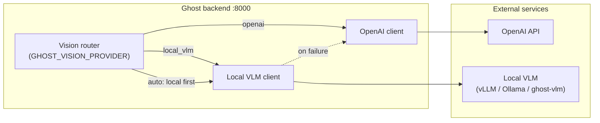
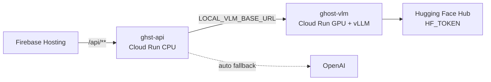

# Local VLM provider

Ghost can route vision workloads to a **separate OpenAI-compatible VLM service** running on your own hardware or in a dedicated GPU container, instead of sending every frame to the OpenAI API.

The feature is **off by default**. With no changes to `.env`, Ghost behaves exactly as before and uses OpenAI for all vision calls.

For production on Firebase + Cloud Run, see [cloud-deployment.md](./cloud-deployment.md) (Firebase Hosting → `ghst-api` → `ghost-vlm` GPU).

## Architecture

Ghost keeps two concerns separate:

1. **Ghost backend** — FastAPI app on port 8000 (`ghst-api` in cloud). Handles operators, cameras, chat, alerts, and orchestration.
2. **Local VLM service** — Any server that exposes an OpenAI-compatible HTTP API (`POST /v1/chat/completions` with multimodal `messages`). In production this is typically **`ghost-vlm`**, a separate Cloud Run GPU service. **Model weights are not stored in git**; vLLM downloads them at container start (requires `HF_TOKEN` on the VLM service).



This split lets you:

- Run heavy vision models on a GPU machine without coupling model upgrades to Ghost releases.
- Keep operator data on-premises when policy requires it.
- Fall back to OpenAI when the local service is down, slow, or misconfigured (`GHOST_VISION_PROVIDER=auto`).

## Environment variables

| Variable | Default | Secret? | Description |
| --- | --- | --- | --- |
| `LOCAL_VLM_ENABLED` | `false` | no | Master switch. When `false`, local VLM is never called regardless of `GHOST_VISION_PROVIDER`. |
| `LOCAL_VLM_BASE_URL` | *(empty)* | no | Base URL of the OpenAI-compatible VLM server (no trailing slash). Local: `http://127.0.0.1:8001`. Cloud: `https://ghost-vlm-….run.app`. |
| `LOCAL_VLM_MODEL` | `Qwen/Qwen3-VL-8B-Instruct` | no | Model name sent in `model` on each request. Must match a model loaded by the VLM server. |
| `LOCAL_VLM_API_KEY` | *(empty)* | **yes** | Optional bearer token sent as `Authorization: Bearer …` to the VLM service. Use for Cloud Run auth between `ghst-api` and `ghost-vlm`. Omit for unauthenticated local vLLM. |
| `LOCAL_VLM_TIMEOUT_SECONDS` | `60` | no | Per-request timeout when calling the local VLM. Slow models, large images, or GPU cold starts may need `90`–`300`. |
| `GHOST_VISION_PROVIDER` | `openai` | no | Routing mode: `openai`, `local_vlm`, or `auto`. See [Provider modes](#provider-modes). |

**`ghost-vlm` only (not set on Ghost backend)**

| Variable | Secret? | Description |
| --- | --- | --- |
| `HF_TOKEN` | **yes** | Hugging Face token for downloading gated models (e.g. `Qwen/Qwen3-VL-8B-Instruct`) at container startup. Store in Secret Manager on the GPU service. |

Related OpenAI vision settings (used when provider is `openai` or when `auto` falls back):

| Variable | Default | Description |
| --- | --- | --- |
| `GHOST_VISION_MODEL` | `gpt-5` | OpenAI model for vision calls on fallback. |
| `GHOST_ALERT_VISION_MODEL` | *(see config)* | Cheaper/faster model for alert scans. |

Copy the block from `backend/.env.example` into your `backend/.env` and adjust values.

### Provider modes

| `GHOST_VISION_PROVIDER` | Behavior |
| --- | --- |
| `openai` | All vision traffic goes to OpenAI. Local VLM settings are ignored. **Default.** |
| `local_vlm` | Vision traffic goes to the local VLM when `LOCAL_VLM_ENABLED=true` and `LOCAL_VLM_BASE_URL` is set. If the local call fails, Ghost returns an error to the caller (no silent OpenAI fallback). |
| `auto` | When `LOCAL_VLM_ENABLED=true`, Ghost tries the local VLM first. On timeout, connection error, or non-2xx response, it **falls back to OpenAI** if an API key is available (per-user key or `OPENAI_API_KEY`). Logs a warning with the failure reason. |

`auto` is the recommended mode for hybrid deployments: local GPU when healthy, cloud when not.

## Quick start — vLLM (recommended)

[vLLM](https://docs.vllm.ai/) serves OpenAI-compatible APIs and works well with multimodal models such as Qwen-VL.

**1. Start the VLM server** (separate terminal or host):

```bash
vllm serve Qwen/Qwen3-VL-8B-Instruct --host 0.0.0.0 --port 8001
```

For gated models, export `HF_TOKEN` before starting vLLM:

```bash
export HF_TOKEN=hf_...
vllm serve Qwen/Qwen3-VL-8B-Instruct --host 0.0.0.0 --port 8001
```

**2. Configure Ghost** (`backend/.env`):

```env
LOCAL_VLM_ENABLED=true
LOCAL_VLM_BASE_URL=http://127.0.0.1:8001
LOCAL_VLM_MODEL=Qwen/Qwen3-VL-8B-Instruct
LOCAL_VLM_TIMEOUT_SECONDS=90
GHOST_VISION_PROVIDER=auto
```

**3. Restart the Ghost backend** and verify with the [diagnostic endpoint](#post-apivisionlocal-analyze).

If vLLM runs on another machine, set `LOCAL_VLM_BASE_URL` to that host (for example `http://192.168.1.50:8001`). Ensure the Ghost backend can reach the port on your network.

## Quick start — Ollama

[Ollama](https://ollama.com/) can run vision models locally with a compatible API on port 11434.

```bash
ollama run llava
```

```env
LOCAL_VLM_ENABLED=true
LOCAL_VLM_BASE_URL=http://127.0.0.1:11434
LOCAL_VLM_MODEL=llava
GHOST_VISION_PROVIDER=auto
```

### Ollama limitations

- **Model quality and latency** — `llava` and similar Ollama vision models are smaller than cloud or vLLM-hosted Qwen-VL tiers. Alert matching and structured scene analysis may be less accurate or slower.
- **Structured JSON** — Ghost's alert and fallback paths expect reliable JSON-shaped answers. Smaller local models may hallucinate schema fields or refuse structured output; prefer vLLM with a capable instruct VLM for production.
- **Concurrency** — Ollama typically serializes requests on one GPU. High camera counts can queue behind each other; tune alert cadence or run a dedicated vLLM instance for throughput.
- **API surface** — Confirm your Ollama version exposes `/v1/chat/completions` with `image_url` content parts. Older setups may need an OpenAI compatibility proxy.

Ollama is fine for development and smoke tests; use vLLM or Cloud Run GPU for operator-facing workloads.

## Cloud Run GPU — `ghost-vlm` service

For production, run the VLM as a **separate Cloud Run service** named `ghost-vlm` on a GPU instance. Ghost stays on `ghst-api`; only `LOCAL_VLM_BASE_URL` and related env vars connect the two.

**Important**

- **`ghost-vlm` is a separate deploy** — not included in `scripts/deploy-firebase.sh`.
- **No model weights in git** — the container pulls `Qwen/Qwen3-VL-8B-Instruct` from Hugging Face at startup.
- **Secrets** — store `HF_TOKEN` on `ghost-vlm` and `LOCAL_VLM_API_KEY` for service-to-service auth (both in Secret Manager).

Full step-by-step diagram and commands: **[cloud-deployment.md](./cloud-deployment.md)**.

### Summary



Illustrative container (weights downloaded at runtime):

```dockerfile
# ghost-vlm/Dockerfile — illustrative; do not commit weights
FROM vllm/vllm-openai:latest

ENV MODEL=Qwen/Qwen3-VL-8B-Instruct
ENV HOST=0.0.0.0
ENV PORT=8080

CMD ["sh", "-c", "vllm serve ${MODEL} --host ${HOST} --port ${PORT}"]
```

**Ghost backend env** (on `ghst-api`):

```env
LOCAL_VLM_ENABLED=true
LOCAL_VLM_BASE_URL=https://ghost-vlm-<hash>-<region>.run.app
LOCAL_VLM_MODEL=Qwen/Qwen3-VL-8B-Instruct
LOCAL_VLM_API_KEY=<from-secret-manager>
LOCAL_VLM_TIMEOUT_SECONDS=120
GHOST_VISION_PROVIDER=auto
```

Recommended Cloud Run settings for `ghost-vlm`:

| Setting | Suggested value | Why |
| --- | --- | --- |
| GPU | 1× NVIDIA L4 | Fits Qwen3-VL-8B with headroom |
| Memory | 24 GiB | Avoid OOM during model load |
| Timeout | 900 s | Model download + first inference on cold start |
| Concurrency | 1 | One vision request per GPU at a time |
| `min-instances` | `0` (cost) or `1` (latency) | Trade cost vs cold start |
| Auth | `--no-allow-unauthenticated` + `LOCAL_VLM_API_KEY` | Do not expose open VLM on the public internet |

## API: `POST /api/vision/local-analyze`

Diagnostic endpoint to test local VLM connectivity without running a full chat or alert cycle.

**Request** — `application/json`:

| Field | Type | Required | Description |
| --- | --- | --- | --- |
| `user_id` | string | yes | Operator user ID (must exist in Ghost DB) |
| `image_base64` | string | yes | JPEG/PNG frame as base64 (no `data:` prefix) |
| `prompt` | string | no | Override prompt; default is a short scene-description instruction |
| `conversation_id` | string | no | If set, ownership is verified |
| `camera_id` | string | no | Optional metadata appended to the prompt |
| `provider` | string | no | `openai`, `local_vlm`, or `auto`; defaults to `GHOST_VISION_PROVIDER` |

**Response** — JSON envelope `{ "ok": true, "data": { … } }`:

```json
{
  "ok": true,
  "data": {
    "provider": "local_vlm",
    "model": "Qwen/Qwen3-VL-8B-Instruct",
    "summary": "Empty loading bay with one parked forklift.",
    "risk_level": "low",
    "objects": [
      { "name": "forklift", "description": "parked forklift", "object_type": "vehicle" }
    ],
    "actions": [],
    "recommended_alert": false
  }
}
```

When `GHOST_VISION_PROVIDER=auto` and the local call fails, a successful fallback response has `"provider": "openai"`. If both local and OpenAI fail, the endpoint returns an error (often `503`) with `error` in `data` when the analysis layer could not produce a result.

**Example** (curl, local dev):

```bash
IMG_B64="$(base64 -w0 /path/to/frame.jpg)"   # macOS: base64 -i frame.jpg

curl -s -X POST http://127.0.0.1:8000/api/vision/local-analyze \
  -H "Content-Type: application/json" \
  -d "{
    \"user_id\": \"<your-user-id>\",
    \"image_base64\": \"${IMG_B64}\",
    \"prompt\": \"Describe people and vehicles in this scene.\",
    \"provider\": \"auto\"
  }"
```

Via production Hosting (same JSON body):

```bash
curl -s -X POST "https://ghst-ebb50.web.app/api/vision/local-analyze" \
  -H "Content-Type: application/json" \
  -d "{ \"user_id\": \"<your-user-id>\", \"image_base64\": \"${IMG_B64}\", \"provider\": \"local_vlm\" }"
```

## Fallback behavior

| Scenario | `openai` | `local_vlm` | `auto` |
| --- | --- | --- | --- |
| `LOCAL_VLM_ENABLED=false` | OpenAI | Error / disabled | OpenAI |
| Local VLM timeout or connection error | OpenAI | Error to client | OpenAI fallback + warning log |
| Local VLM HTTP 4xx/5xx | OpenAI | Error to client | OpenAI fallback + warning log |
| Local returns empty or invalid content | OpenAI | Error to client | OpenAI fallback + warning log |
| No OpenAI key on fallback | OpenAI error | Local error only | Error after local failure |

Fallback applies to vision paths that support provider routing (chat image analysis, structured fallback, alerts when configured). The backend logs `local_vlm_fallback` events with reason and latency so operators can monitor GPU health in admin logs.

## Troubleshooting

### No GPU available

**Symptoms:** vLLM fails to start with CUDA/GPU errors; Cloud Run deploy rejects `--gpu`.

**Fixes:**

- Local: install NVIDIA drivers + CUDA matching your vLLM image; confirm `nvidia-smi` works.
- Cloud: request GPU quota in GCP (`nvidia-l4` in `us-central1`); deploy `ghost-vlm` with `--gpu 1 --gpu-type nvidia-l4`.
- Without a GPU, use `GHOST_VISION_PROVIDER=openai` or Ollama on CPU (slow, not recommended for production alerts).

### Model load time (slow first start)

**Symptoms:** `ghost-vlm` pod stays unhealthy for several minutes after deploy; logs show Hugging Face download progress.

**Fixes:**

- Expected on first boot — Qwen3-VL-8B is several GB; download + load can take **5–15 minutes**.
- Set Cloud Run startup probe / timeout ≥ 900 s for the VLM service.
- Do not commit weights to git; use `HF_TOKEN` and cache via container image rebuild only if you maintain a private registry mirror.

### Cold start (scale-to-zero)

**Symptoms:** First request after idle returns timeout from `ghst-api`; `LOCAL_VLM_TIMEOUT_SECONDS` exceeded; `auto` falls back to OpenAI.

**Fixes:**

- Increase `LOCAL_VLM_TIMEOUT_SECONDS` on `ghst-api` (e.g. `180`–`300`).
- Set `--min-instances 1` on `ghost-vlm` to keep the model warm (higher cost).
- Use `GHOST_VISION_PROVIDER=auto` so operators still get answers via OpenAI while GPU warms up.

### OOM (out of memory)

**Symptoms:** vLLM process killed; Cloud Run revision crashes with exit 137; logs mention CUDA OOM.

**Fixes:**

- Use a larger GPU (L4 24 GiB) or reduce model size.
- Lower concurrent requests (`--concurrency 1` on `ghost-vlm`).
- Avoid running YOLO/torch and vLLM in the same container — keep `ghost-vlm` separate from `ghst-api`.

### Hugging Face auth (`HF_TOKEN`)

**Symptoms:** Model download fails with 401/403; "gated repo" or "access denied" in `ghost-vlm` logs.

**Fixes:**

- Create a [Hugging Face access token](https://huggingface.co/settings/tokens) with read access.
- Accept the model license on the model page for `Qwen/Qwen3-VL-8B-Instruct`.
- Store token in Secret Manager as `HF_TOKEN` and mount on **`ghost-vlm` only** (not required on `ghst-api`).
- Verify: `HF_TOKEN=hf_… huggingface-cli download Qwen/Qwen3-VL-8B-Instruct --dry-run` from a machine with network access.

### OpenAI fallback not working

**Symptoms:** `auto` mode returns errors after local failure; no OpenAI response.

**Fixes:**

- Ensure `OPENAI_API_KEY` is set on `ghst-api` (Secret Manager) or the operator has a stored API key.
- Check logs for `local_vlm_fallback` — fallback only runs when local fails, not when local returns garbage JSON (may still fallback on empty/error).
- `local_vlm` mode **never** falls back — switch to `auto` for resilience.

### Request timeout

**Symptoms:** `asyncio.TimeoutError` or `local_vlm_unavailable` in logs; client sees slow then failed analyze.

**Fixes:**

- Raise `LOCAL_VLM_TIMEOUT_SECONDS` (default `60` is tight for cold GPU + large images).
- Shrink input images before base64 encode where possible.
- Warm the service with a diagnostic `POST /api/vision/local-analyze` after deploy.
- Check network path: `ghst-api` must reach `LOCAL_VLM_BASE_URL` (VPC connector or authenticated Cloud Run URL).

### Wrong model name

**Symptoms:** VLM returns 404 or "model not found".

**Fixes:**

- Align `LOCAL_VLM_MODEL` with the string passed to `vllm serve` (e.g. `Qwen/Qwen3-VL-8B-Instruct`).
- After changing the served model, redeploy `ghost-vlm` and update `LOCAL_VLM_MODEL` on `ghst-api`.

## Operational notes

- **Security** — Do not expose an unauthenticated VLM port on the public internet. Use localhost, a private VPC, Cloud Run IAM, or `LOCAL_VLM_API_KEY` between `ghst-api` and `ghost-vlm`.
- **Cost** — Local inference shifts spend from OpenAI tokens to GPU hardware and power. `auto` mode avoids outages without forcing 100% cloud usage.
- **Model parity** — Local VLMs may not match OpenAI `gpt-5` / `gpt-4o` quality on fine-grained rules (license plates, small objects). Validate alert rules after switching providers.
- **Existing OpenAI settings** — `GHOST_VISION_MODEL`, `GHOST_ALERT_VISION_MODEL`, and related keys still apply when the provider is `openai` or when `auto` falls back.

## See also

- [cloud-deployment.md](./cloud-deployment.md) — Firebase Hosting → `ghst-api` → `ghost-vlm` production layout
- `backend/.env.example` — copy-paste local VLM block
- `backend/app/config.py` — authoritative defaults
- [Ghost brain guide](./ghost-brain-guide.md) — how vision fits into chat and alerts
