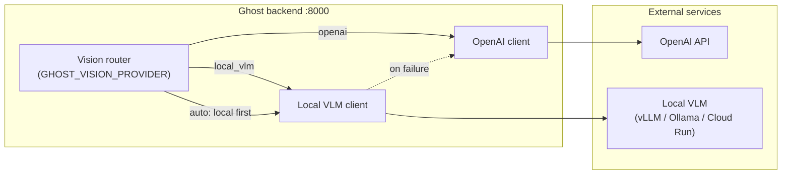

# Local VLM provider

Ghost can route vision workloads to a **separate OpenAI-compatible VLM service** running on your own hardware or in a dedicated GPU container, instead of sending every frame to the OpenAI API.

The feature is **off by default**. With no changes to `.env`, Ghost behaves exactly as before and uses OpenAI for all vision calls.

## Architecture

Ghost keeps two concerns separate:

1. **Ghost backend** — FastAPI app on port 8000. Handles operators, cameras, chat, alerts, and orchestration.
2. **Local VLM service** — Any server that exposes an OpenAI-compatible HTTP API (`POST /v1/chat/completions` with multimodal `messages`).

When local VLM is enabled, the backend forwards image-bearing requests to the VLM service at `LOCAL_VLM_BASE_URL`. The backend translates Ghost's internal prompts and image payloads into the standard OpenAI chat-completions shape, then maps the response back into Ghost's existing vision pipeline.



This split lets you:

- Run heavy vision models on a GPU machine without coupling model upgrades to Ghost releases.
- Keep operator data on-premises when policy requires it.
- Fall back to OpenAI when the local service is down, slow, or misconfigured (`GHOST_VISION_PROVIDER=auto`).

## Environment variables

| Variable | Default | Description |
| --- | --- | --- |
| `LOCAL_VLM_ENABLED` | `false` | Master switch. When `false`, local VLM is never called regardless of `GHOST_VISION_PROVIDER`. |
| `LOCAL_VLM_BASE_URL` | *(empty)* | Base URL of the OpenAI-compatible VLM server (no trailing slash). Example: `http://127.0.0.1:8001`. |
| `LOCAL_VLM_MODEL` | *(empty)* | Model name sent in `model` on each request. Must match a model loaded by the VLM server. |
| `LOCAL_VLM_API_KEY` | *(empty)* | Optional bearer token for the VLM service. Omit when the server has no auth (typical for local vLLM/Ollama). |
| `LOCAL_VLM_TIMEOUT_SECONDS` | `60` | Per-request timeout when calling the local VLM. Slow models or large images may need a higher value. |
| `GHOST_VISION_PROVIDER` | `openai` | Routing mode: `openai`, `local_vlm`, or `auto`. See [Provider modes](#provider-modes). |

Copy the block from `backend/.env.example` into your `backend/.env` and adjust values.

### Provider modes

| `GHOST_VISION_PROVIDER` | Behavior |
| --- | --- |
| `openai` | All vision traffic goes to OpenAI. Local VLM settings are ignored. **Default.** |
| `local_vlm` | Vision traffic goes to the local VLM when `LOCAL_VLM_ENABLED=true` and `LOCAL_VLM_BASE_URL` is set. If the local call fails, Ghost returns an error to the caller (no silent OpenAI fallback). |
| `auto` | When `LOCAL_VLM_ENABLED=true`, Ghost tries the local VLM first. On timeout, connection error, or non-2xx response, it **falls back to OpenAI** if an API key is available (per-user key or `OPENAI_API_KEY`). Logs a warning with the failure reason. |

`auto` is the recommended mode for hybrid deployments: local GPU when healthy, cloud when not.

## Quick start — vLLM (recommended)

[vLLM](https://docs.vllm.ai/) serves OpenAI-compatible APIs and works well with multimodal models such as Qwen-VL.

**1. Start the VLM server** (separate terminal or host):

```bash
vllm serve Qwen/Qwen3-VL-8B-Instruct --host 0.0.0.0 --port 8001
```

**2. Configure Ghost** (`backend/.env`):

```env
LOCAL_VLM_ENABLED=true
LOCAL_VLM_BASE_URL=http://127.0.0.1:8001
LOCAL_VLM_MODEL=Qwen/Qwen3-VL-8B-Instruct
LOCAL_VLM_TIMEOUT_SECONDS=90
GHOST_VISION_PROVIDER=auto
```

**3. Restart the Ghost backend** and verify with the [diagnostic endpoint](#post-apivisionlocal-analyze).

If vLLM runs on another machine, set `LOCAL_VLM_BASE_URL` to that host (for example `http://192.168.1.50:8001`). Ensure the Ghost backend can reach the port on your network.

## Quick start — Ollama

[Ollama](https://ollama.com/) can run vision models locally with a compatible API on port 11434.

```bash
ollama run llava
```

```env
LOCAL_VLM_ENABLED=true
LOCAL_VLM_BASE_URL=http://127.0.0.1:11434
LOCAL_VLM_MODEL=llava
GHOST_VISION_PROVIDER=auto
```

### Ollama limitations

- **Model quality and latency** — `llava` and similar Ollama vision models are smaller than cloud or vLLM-hosted Qwen-VL tiers. Alert matching and structured scene analysis may be less accurate or slower.
- **Structured JSON** — Ghost's alert and fallback paths expect reliable JSON-shaped answers. Smaller local models may hallucinate schema fields or refuse structured output; prefer vLLM with a capable instruct VLM for production.
- **Concurrency** — Ollama typically serializes requests on one GPU. High camera counts can queue behind each other; tune alert cadence or run a dedicated vLLM instance for throughput.
- **API surface** — Confirm your Ollama version exposes `/v1/chat/completions` with `image_url` content parts. Older setups may need an OpenAI compatibility proxy.

Ollama is fine for development and smoke tests; use vLLM or Cloud Run GPU for operator-facing workloads.

## Cloud Run GPU — `ghost-vlm` service

For production, run the VLM as a **separate Cloud Run service** (for example `ghost-vlm`) on a GPU instance. Ghost stays on its existing Cloud Run service or VM; only `LOCAL_VLM_BASE_URL` points at the VLM service URL.

Conceptual container (not a full deploy script):

```dockerfile
# ghost-vlm/Dockerfile — illustrative
FROM vllm/vllm-openai:latest

ENV MODEL=Qwen/Qwen3-VL-8B-Instruct
ENV HOST=0.0.0.0
ENV PORT=8080

CMD ["vllm", "serve", "${MODEL}", "--host", "0.0.0.0", "--port", "8080"]
```

Deploy `ghost-vlm` with a GPU (L4 or better), allow authenticated ingress or VPC internal access, then set on the Ghost backend:

```env
LOCAL_VLM_ENABLED=true
LOCAL_VLM_BASE_URL=https://ghost-vlm-<hash>-<region>.run.app
LOCAL_VLM_MODEL=Qwen/Qwen3-VL-8B-Instruct
LOCAL_VLM_API_KEY=<optional-cloud-run-iam-or-api-token>
GHOST_VISION_PROVIDER=auto
```

Keep GPU memory and cold-start latency in mind: the first request after scale-to-zero can exceed `LOCAL_VLM_TIMEOUT_SECONDS`; increase the timeout or set a minimum instance count on `ghost-vlm`.

## API: `POST /api/vision/local-analyze`

Diagnostic endpoint to test local VLM connectivity without running a full chat or alert cycle.

**Request** — `multipart/form-data` or JSON with a base64 image (exact shape matches the backend route implementation):

| Field | Type | Required | Description |
| --- | --- | --- | --- |
| `image` | file or base64 | yes | Frame or still to analyze |
| `prompt` | string | no | Override prompt; default is a short scene-description instruction |

**Response** — JSON:

```json
{
  "provider": "local_vlm",
  "model": "Qwen/Qwen3-VL-8B-Instruct",
  "text": "…natural language analysis…",
  "elapsed_ms": 1240,
  "fallback_used": false
}
```

When `GHOST_VISION_PROVIDER=auto` and the local call fails, a successful fallback response sets `fallback_used: true` and `provider: "openai"`. If both local and OpenAI fail, the endpoint returns `503` with an error body.

**Example** (curl, multipart):

```bash
curl -s -X POST http://127.0.0.1:8000/api/vision/local-analyze \
  -H "Authorization: Bearer <ghost-api-key>" \
  -F "image=@/path/to/frame.jpg" \
  -F "prompt=Describe people and vehicles in this scene."
```

Requires a valid Ghost operator API key (same auth as other `/api/*` routes).

## Fallback behavior

| Scenario | `openai` | `local_vlm` | `auto` |
| --- | --- | --- | --- |
| `LOCAL_VLM_ENABLED=false` | OpenAI | Error / disabled | OpenAI |
| Local VLM timeout or connection error | OpenAI | Error to client | OpenAI fallback + warning log |
| Local VLM HTTP 4xx/5xx | OpenAI | Error to client | OpenAI fallback + warning log |
| Local returns empty or invalid content | OpenAI | Error to client | OpenAI fallback + warning log |
| No OpenAI key on fallback | OpenAI error | Local error only | Error after local failure |

Fallback applies to vision paths that support provider routing (chat image analysis, structured fallback, alerts when configured). The backend logs `local_vlm_fallback` events with reason and latency so operators can monitor GPU health in admin logs.

## Operational notes

- **Security** — Do not expose an unauthenticated VLM port on the public internet. Use localhost, a private VPC, or Cloud Run IAM between Ghost and `ghost-vlm`.
- **Cost** — Local inference shifts spend from OpenAI tokens to GPU hardware and power. `auto` mode avoids outages without forcing 100% cloud usage.
- **Model parity** — Local VLMs may not match OpenAI `gpt-5` / `gpt-4o` quality on fine-grained rules (license plates, small objects). Validate alert rules after switching providers.
- **Existing OpenAI settings** — `GHOST_VISION_MODEL`, `GHOST_ALERT_VISION_MODEL`, and related keys still apply when the provider is `openai` or when `auto` falls back.

## See also

- `backend/.env.example` — copy-paste local VLM block
- `backend/app/config.py` — authoritative defaults (when implemented on this branch)
- [Ghost brain guide](./ghost-brain-guide.md) — how vision fits into chat and alerts
