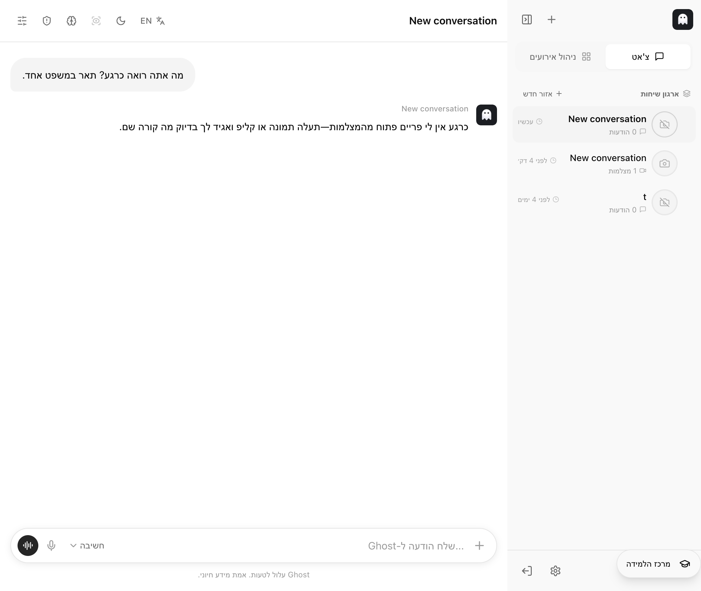
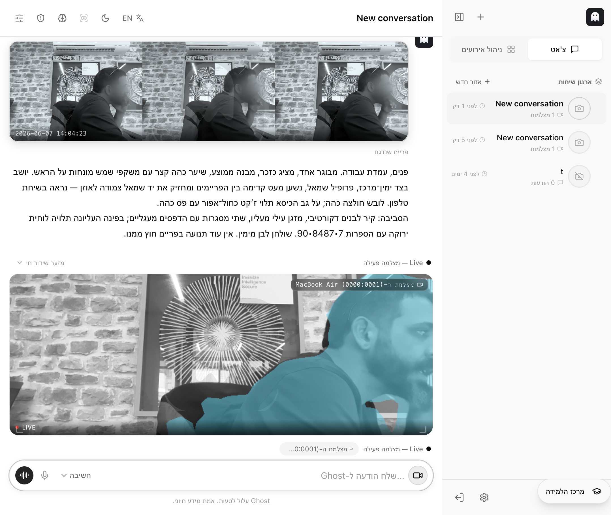
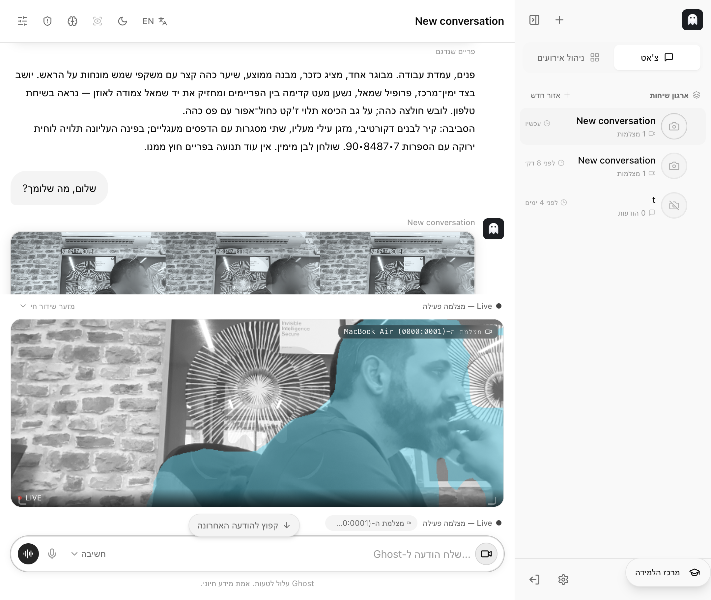
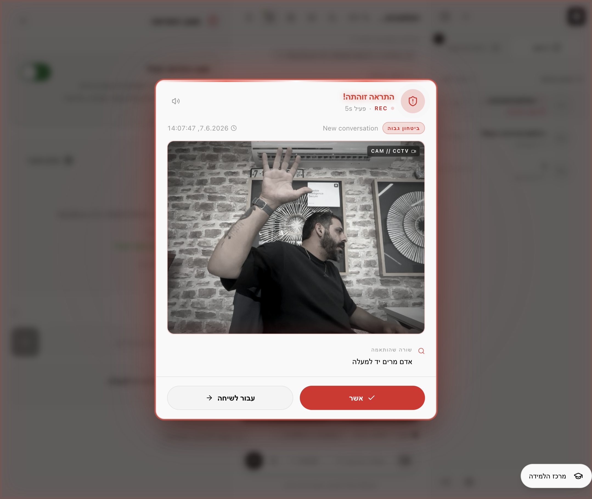

# דוח בדיקת Ghost — בדיקה מלאה בדפדפן

> בדיקה אינטראקטיבית מלאה שרצה חיה בדפדפן של Cursor, מול אפליקציה פעילה ומול מצלמה אמיתית עם מפעיל נוכח.

## פרטי הבדיקה

| פריט | ערך |
|------|-----|
| תאריך הבדיקה | 2026-06-07 |
| שעת התחלה | 13:57:38 |
| שעת סיום | 14:08:39 |
| משך כולל של הבדיקה | כ-11 דקות ושנייה |
| משתמש שנבדק | tester (`06b4f626ad654dfaab26164b9305f3c1`) |
| שיחה שנבדקה | `05c7c57ce0ad438ba049eb92f15f55ff` |

## תקציר מנהלים

הבדיקה עברה בהצלחה מלאה — כל ארבעת השלבים עבדו. בתחילת הבדיקה התגלתה תקלה חשובה: השרת המקומי רץ עם מפתח לא-תקין, כך שגוסט לא הצליח לענות בכלל והחזיר הודעת מערכת קבועה. לאחר הזנת מפתח תקין, גוסט ענה כראוי בכל השלבים: ענה ללא מצלמה, תיאר בפירוט תמונה חיה מהמצלמה, יישם הנחיית מערכת בדיוק כפי שהתבקש, ובמצב התראה — זיהה תוך שניות בודדות שהמפעיל הרים יד והקפיץ התראה אדומה על המסך.

## ממצא חשוב שטופל במהלך הבדיקה

בתחילת הבדיקה גוסט החזיר בכל פנייה את ההודעה "Ghost לא הצליח לעבד את הבקשה הזו...". הסיבה: השרת המקומי רץ עם מפתח לא-תקין (`sk-test-key`), שגרם לכל קריאה למודל להיכשל (שגיאת הרשאה 401). מנגנון ההגנה של גוסט תפס את הכשל והחליף אותו בהודעת ברנד מנומסת — בדיוק כפי שהוא אמור לעשות. לאחר הזנת מפתח תקין למשתמש, כל הפניות חזרו לעבוד. **מסקנה:** התשתית (צ'אט, שידור חי, דגימת פריימים, מנגנון ההגנה) תקינה; נדרש רק מפתח תקין כדי שגוסט יוכל לחשוב ולענות.

## מה נבדק — שלב אחר שלב

### 1. שיחה חדשה והודעה ללא מצלמה
- **מה עשינו:** פתחנו שיחה חדשה ושאלנו "מה אתה רואה כרגע?" בלי מצלמה מחוברת.
- **תוצאה:** עבר
- **זמן עד שגוסט סיים לענות:** כ-8.3 שניות
- **בשפה פשוטה:** גוסט ענה תשובה הגיונית ובטון שלו: "כרגע אין לי פריים פתוח מהמצלמות—תעלה תמונה או קליפ ואגיד לך בדיוק מה קורה שם." לא הופיעה תמונה בתשובה — וזה נכון, כי לא הייתה מצלמה.

### 2. הודעה עם מצלמה מחוברת
- **מה עשינו:** חיברנו מצלמת לייב (MacBook Air) וביקשנו "תאר בפירוט מה נמצא בפריים מהמצלמה כרגע."
- **תוצאה:** עבר
- **זמן עד שגוסט סיים לענות:** כ-20.8 שניות
- **האם הופיע פריים מהמצלמה בתשובה?** כן — שורת תמונות ממוזערות עם תווית "פריים שנדגם".
- **בשפה פשוטה:** גוסט צירף תמונות רגע מהמצלמה ותיאר אותן בפירוט רב — אדם יושב בעמדת עבודה, שיער כהה ומשקפי שמש על הראש, יד צמודה לאוזן כמו בשיחת טלפון, קיר לבנים ומזגן ברקע, ואפילו קרא מספר על שלט בפינה.

### 3. הנחיות לגוסט (איך לענות)
- **מה עשינו:** נתנו לגוסט הנחיית מערכת: "ענה תמיד בעברית ובקצרה, וסיים כל תשובה בתגית [GHOST-OK]." שמרנו, ואז שלחנו "שלום, מה שלומך?".
- **תוצאה:** עבר
- **זמן תגובה:** כ-12.7 שניות
- **האם גוסט יישם את ההנחיה?** כן — התשובה הסתיימה בדיוק בתגית **[GHOST-OK]**.
- **מה גוסט ענה בפועל (קטע):** "היי, שקט—מבוגר מציג כזכר עם שיער כהה קצר ומשקפי שמש על הראש... [GHOST-OK]"
- **בשפה פשוטה:** גוסט שמע להנחיה וסיים את התשובה בדיוק בסימן שביקשנו.

### 4. התראה על אדם שמרים יד
- **מה עשינו:** הגדרנו שורת התראה "אדם מרים יד למעלה", הפעלנו את מצב ההתראה, והמפעיל הרים יד מול המצלמה.
- **תוצאה:** עבר
- **זמן עד שההתראה הופיעה:** מספר שניות בלבד מרגע הפעלת מצב ההתראה (האירוע הראשון נרשם בשרת תוך ~2–4 שניות).
- **האם הופיעה התראה על המסך?** כן — חלון אדום גדול עם הכיתוב "התראה זוהתה!", תמונת הרגע של היד המורמת, רמת ודאות "ביטחון גבוה", והשורה שהותאמה "אדם מרים יד למעלה".
- **אימות בשרת:** נרשמו 2 אירועי התראה תואמים לשורה, שניהם ב"ביטחון גבוה".
- **בשפה פשוטה:** ברגע שהמפעיל הרים יד, גוסט זיהה את זה כמעט מיד והקפיץ התראה אדומה ברורה על המסך.

## טבלת סיכום זמני תגובה

| שלב | זמן עד סיום / התראה | תוצאה |
|-----|----------------------|-------|
| הודעה ללא מצלמה | ~8.3 ש | עבר |
| הודעה עם מצלמה | ~20.8 ש | עבר |
| הנחיות לגוסט | ~12.7 ש | עבר |
| התראה על הרמת יד | מספר שניות (עד התראה) | עבר |

> הערה על מדידה: זמני התגובה נמדדו לפי חותמות הזמן של ההודעות בשרת (זמן הסיום). הזמן עד "המילה הראשונה" לא הופרד בנפרד כי הממשק הציג את התשובות כבלוק קרוב-לשלם.

## מסקנה כללית

המערכת עובדת כמצופה בכל ארבעת השלבים — צ'אט רגיל, ראייה ממצלמה חיה, יישום הנחיות, וזיהוי התראה בזמן אמת. הדבר היחיד שדרש תשומת לב: יש לוודא שלשרת/למשתמש מוגדר מפתח Ghost תקין; ללא מפתח תקין גוסט לא יכול לענות (וזה מה שראינו בתחילת הבדיקה, ותוקן במקום).

## תמונות מהבדיקה

- שלב 1: `assets/phase1-no-camera.png`
- שלב 2: `assets/phase2-camera.png`
- שלב 3: `assets/phase3-system-prompt.png`
- שלב 4: `assets/phase4-alert.png`
