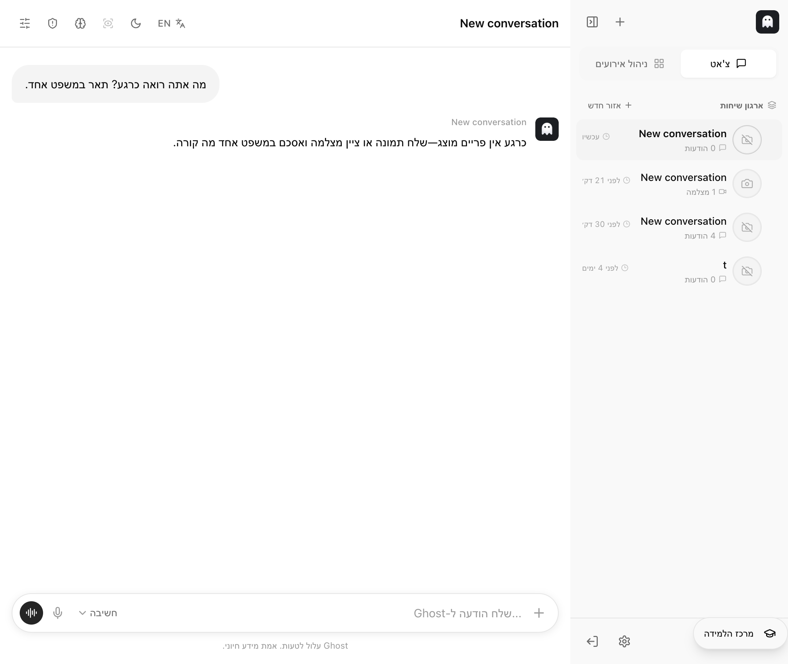
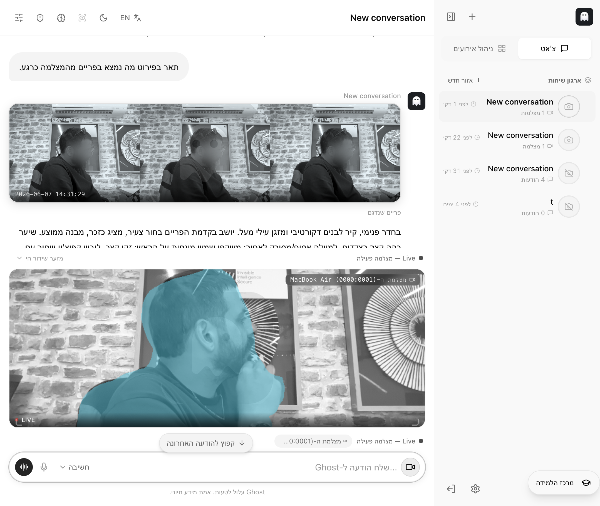
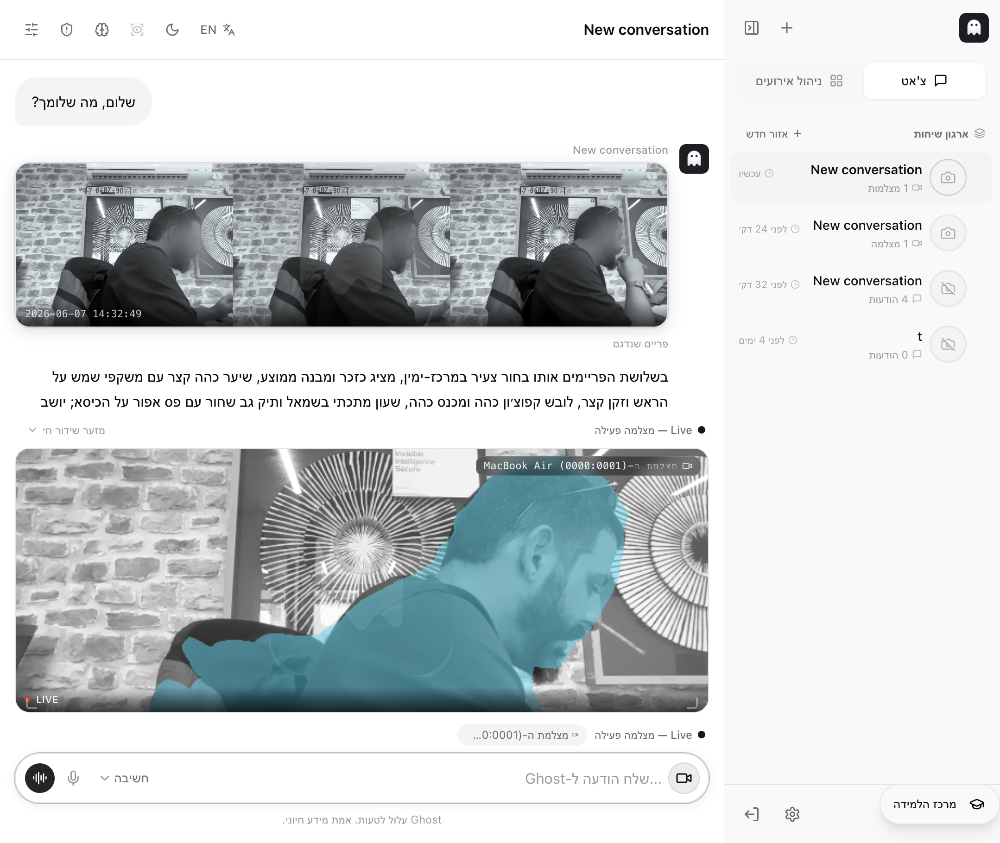
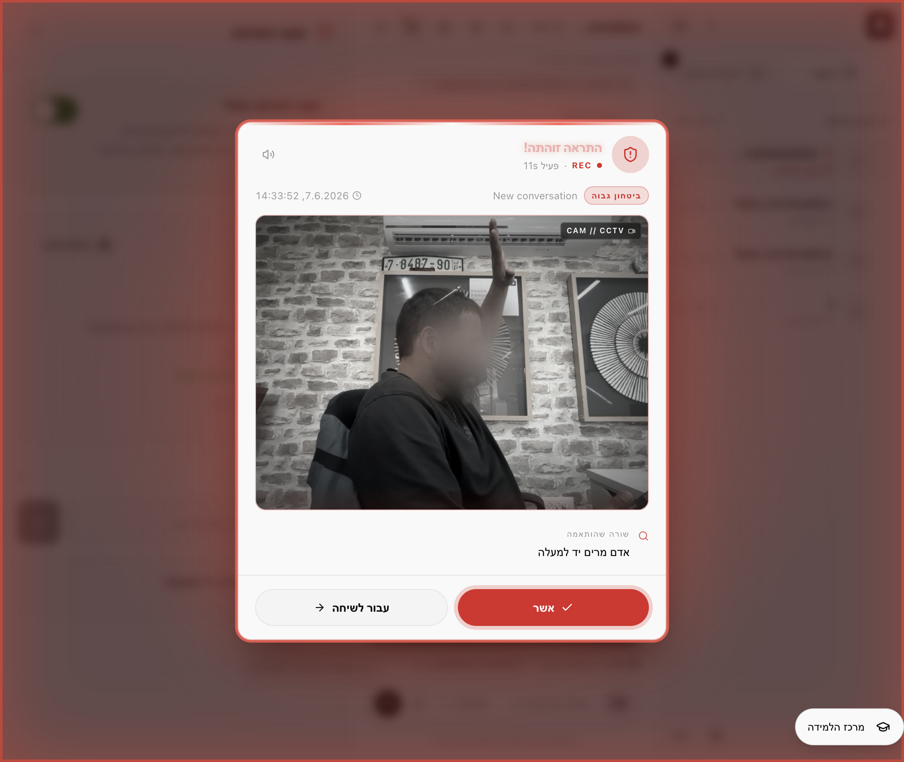

# דוח בדיקת Ghost — בדיקה מלאה בדפדפן

> בדיקה אינטראקטיבית מלאה שרצה חיה בדפדפן של Cursor, מול אפליקציה פעילה ומול מצלמה אמיתית עם מפעיל נוכח.

## פרטי הבדיקה

| פריט | ערך |
|------|-----|
| תאריך הבדיקה | 2026-06-07 |
| שעת התחלה | 14:29:16 |
| שעת סיום | 14:34:44 |
| משך כולל של הבדיקה | כ-5 דקות וחצי |
| משתמש שנבדק | tester (`06b4f626ad654dfaab26164b9305f3c1`) |
| שיחה שנבדקה | `40a69f7bc02e49638bd1678f433e124a` |

## תקציר מנהלים

הבדיקה עברה בהצלחה מלאה — כל ארבעת השלבים עבדו ללא תקלות. גוסט ענה ללא מצלמה, תיאר בפירוט תמונה חיה מהמצלמה, יישם הנחיית מערכת בדיוק כפי שהתבקש (סיים בתגית [GHOST-OK]), ובמצב התראה — זיהה תוך שניות בודדות שהמפעיל הרים יד והקפיץ התראה אדומה ברורה על המסך. זמני התגובה היו טובים: בין כ-3 שניות (צ'אט רגיל) לכ-19 שניות (ניתוח תמונה).

## מה נבדק — שלב אחר שלב

### 1. שיחה חדשה והודעה ללא מצלמה
- **מה עשינו:** פתחנו שיחה חדשה ושאלנו "מה אתה רואה כרגע?" בלי מצלמה מחוברת.
- **תוצאה:** עבר
- **זמן עד שגוסט סיים לענות:** כ-3.3 שניות
- **בשפה פשוטה:** גוסט ענה מהר ובטון שלו: "כרגע אין פריים מוצג—שלח תמונה או ציין מצלמה ואסכם במשפט אחד מה קורה." לא הופיעה תמונה — וזה נכון, כי לא הייתה מצלמה.

### 2. הודעה עם מצלמה מחוברת
- **מה עשינו:** חיברנו מצלמת לייב (MacBook Air) וביקשנו "תאר בפירוט מה נמצא בפריים מהמצלמה כרגע."
- **תוצאה:** עבר
- **זמן עד שגוסט סיים לענות:** כ-18.7 שניות
- **האם הופיע פריים מהמצלמה בתשובה?** כן — שורת תמונות ממוזערות עם תווית "פריים שנדגם".
- **בשפה פשוטה:** גוסט צירף תמונות רגע מהמצלמה ותיאר בפירוט — בחור צעיר יושב בעמדת עבודה, שיער כהה ומשקפי שמש על הראש, מחזיק טלפון ומביט בו, קיר לבנים ומזגן ברקע, ואפילו קרא מספר על שלט בקיר.

### 3. הנחיות לגוסט (איך לענות)
- **מה עשינו:** נתנו לגוסט הנחיית מערכת: "ענה תמיד בעברית ובקצרה, וסיים כל תשובה בתגית [GHOST-OK]." שמרנו ושלחנו "שלום, מה שלומך?".
- **תוצאה:** עבר
- **זמן תגובה:** כ-15.0 שניות
- **האם גוסט יישם את ההנחיה?** כן — התשובה הסתיימה בדיוק בתגית **[GHOST-OK]**.
- **בשפה פשוטה:** גוסט שמע להנחיה וסיים את התשובה בדיוק בסימן שביקשנו.

### 4. התראה על אדם שמרים יד
- **מה עשינו:** הגדרנו שורת התראה "אדם מרים יד למעלה", הפעלנו את מצב ההתראה, והמפעיל הרים יד מול המצלמה.
- **תוצאה:** עבר
- **זמן עד שההתראה הופיעה:** מספר שניות בלבד מרגע ההפעלה (אירועי ההתראה נרשמו בשרת ב-14:33:51 וב-14:33:52, "ביטחון גבוה").
- **האם הופיעה התראה על המסך?** כן — חלון אדום גדול עם "התראה זוהתה!", תמונת הרגע של היד המורמת, רמת ודאות "ביטחון גבוה" והשורה שהותאמה "אדם מרים יד למעלה".
- **בשפה פשוטה:** ברגע שהמפעיל הרים יד, גוסט זיהה את זה כמעט מיד והקפיץ התראה אדומה ברורה על המסך.

## טבלת סיכום זמני תגובה

| שלב | זמן עד סיום / התראה | תוצאה |
|-----|----------------------|-------|
| הודעה ללא מצלמה | ~3.3 ש | עבר |
| הודעה עם מצלמה | ~18.7 ש | עבר |
| הנחיות לגוסט | ~15.0 ש | עבר |
| התראה על הרמת יד | מספר שניות (עד התראה) | עבר |

> הערה על מדידה: זמני התגובה נמדדו לפי חותמות הזמן של ההודעות בשרת (זמן הסיום).

## מסקנה כללית

המערכת עובדת כמצופה בכל ארבעת השלבים — צ'אט רגיל, ראייה ממצלמה חיה, יישום הנחיות, וזיהוי התראה בזמן אמת. הבדיקה הסתיימה ללא תקלות (בניגוד לבדיקה הקודמת היום, שבה התגלה מפתח לא-תקין — הפעם המפתח התקין כבר היה מוגדר והכול עבד חלק).

## תמונות מהבדיקה

- שלב 1: `assets/run2-phase1-no-camera.png`
- שלב 2: `assets/run2-phase2-camera.png`
- שלב 3: `assets/run2-phase3-system-prompt.png`
- שלב 4: `assets/run2-phase4-alert.png`
