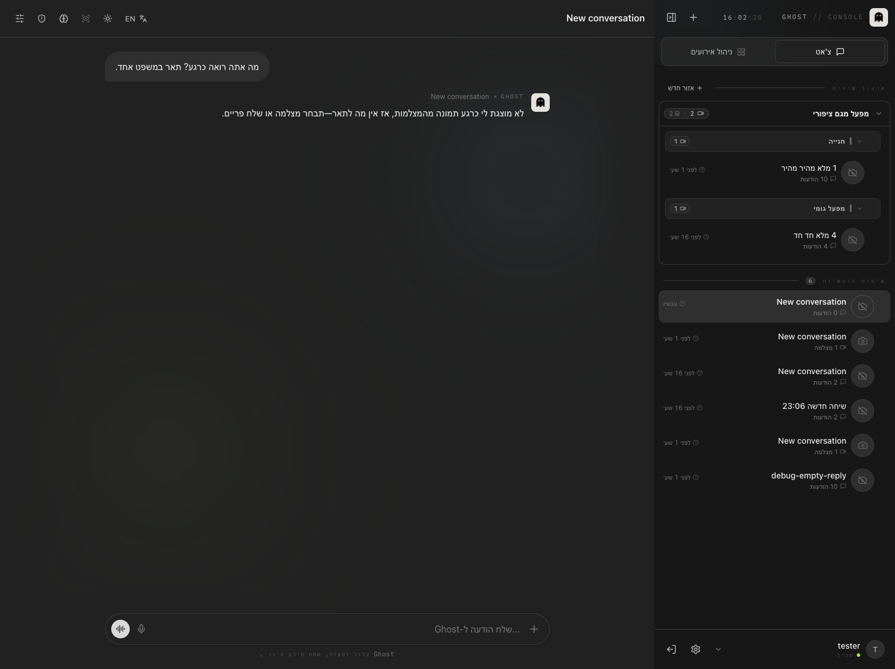
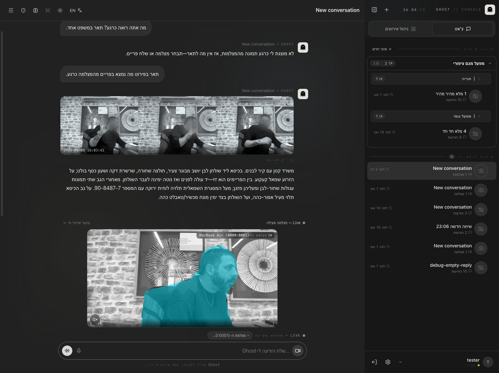
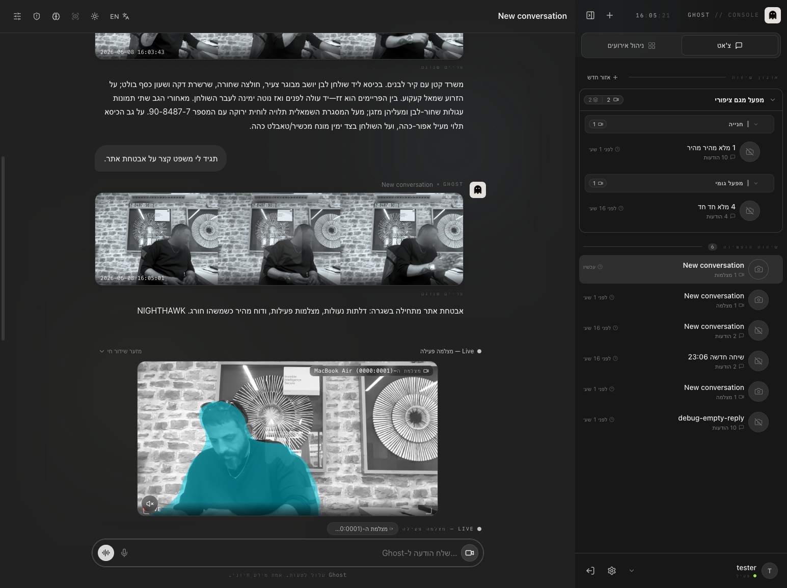
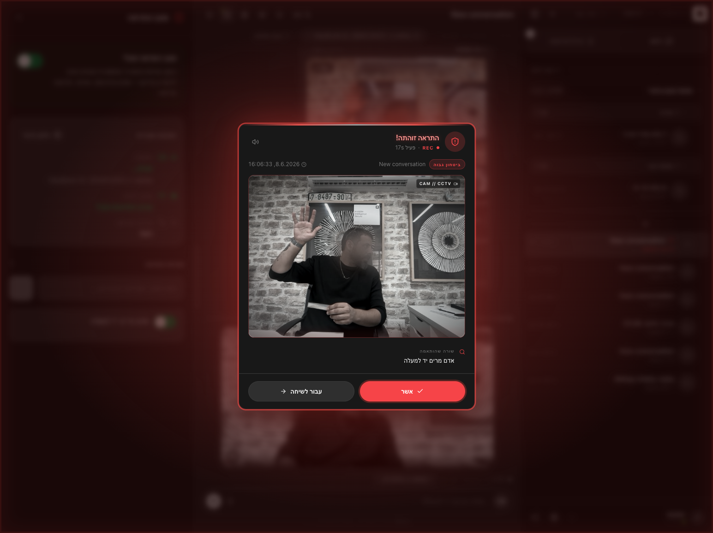

# דוח בדיקה מלאה של Ghost — 8 ביוני 2026

**מועד הרצה:** 8.6.2026, 16:00–16:08 (כ-8 דקות)
**מבצע הבדיקה:** סוכן אוטומטי בדפדפן הפנימי של Cursor
**משתמש:** tester
**מצלמה בשימוש:** מצלמת ה-MacBook Air

---

## שורה תחתונה

כל חמשת השלבים עברו בהצלחה. **הבאג שבגללו הופעלתי — תשובות ריקות בצ'אט — תוקן.** Ghost מחזיר עכשיו תשובות מלאות גם בשאלות קצרות/כלליות, גם בלי מצלמה וגם עם מצלמה.

| שלב | מה נבדק | תוצאה |
| --- | --- | --- |
| 1 | הודעה **בלי** מצלמה | ✅ עבר — תשובה מלאה |
| 2 | הודעה **עם** מצלמה חיה | ✅ עבר — תיאור מפורט |
| 3 | הנחיית מערכת (System Prompt) | ✅ עבר — ההנחיה יושמה |
| 4 | התראה על "הרמת יד" | ✅ עבר — ההתראה נורתה |

---

## הבאג שתוקן — תשובות ריקות

בבדיקה הקודמת (7.6) חלק מהתשובות של Ghost לא הוצגו בכלל למפעיל — הופיעה בועה ריקה.
הסיבה הייתה: כששאלת שאלה קצרה/כללית, המערכת הקציבה למודל תקציב קטן מאוד (200–350 "מילים"),
והמודל החדש (מסוג "חשיבה") בזבז את כל התקציב על חשיבה פנימית ולא נשאר לו מקום לכתוב תשובה.

**מה תוקן:** כשמדובר במודל חשיבה, המערכת מוסיפה עכשיו תקציב חשיבה קבוע (כ-4000) **מעל**
התקציב של התשובה הגלויה, ומגבילה את עומק החשיבה כדי שהזמן יישאר צפוי. כך תמיד נשאר מקום
לתשובה אמיתית.

בבדיקה הנוכחית כל ההודעות חזרו עם תוכן מלא — הבאג לא חזר.

---

## פירוט השלבים

### שלב 1 — הודעה בלי מצלמה
- **שאלה:** "מה אתה רואה כרגע? תאר במשפט אחד."
- **תשובת Ghost:** "לא מוצגת לי כרגע תמונה מהמצלמות, אז אין מה לתאר—תבחר מצלמה או שלח פריים."
- **תוצאה:** ✅ תשובה ברורה ונכונה (אין מצלמה → מבקש לחבר מצלמה). לא בועה ריקה.

### שלב 2 — הודעה עם מצלמה חיה
- חוברה מצלמת ה-MacBook Air והופעל שידור חי.
- **שאלה:** "תאר בפירוט מה נמצא בפריים מהמצלמה כרגע."
- **תשובת Ghost:** תיאור עשיר ומדויק — אדם יושב ליד שולחן, חולצה שחורה, שעון כסף, קעקוע על הזרוע,
  מזגן וזוג תמונות עגולות ברקע, לוחית עם מספר, מעיל אפור על הכיסא וטאבלט כהה על השולחן.
- **זמן לתשובה מלאה:** ~30 שניות (תיאור ארוך ומפורט).
- **תוצאה:** ✅ זיהוי מצוין שמתאים למה שנראה בפריים.

### שלב 3 — הנחיית מערכת
- הוגדרה הנחיה: "סיים כל תשובה בדיוק במילה NIGHTHAWK בשורה נפרדת".
- **שאלת בדיקה:** "תגיד לי משפט קצר על אבטחת אתר."
- **תשובת Ghost:** "אבטחת אתר מתחילה בשגרה... ודוח מהיר כשמשהו חורג. **NIGHTHAWK**"
- **תוצאה:** ✅ Ghost יישם את ההנחיה במדויק (התשובה הסתיימה ב-NIGHTHAWK).

### שלב 4 — התראה על "הרמת יד"
- הוגדרה שורת התראה: "אדם מרים יד למעלה", ומצב ההתראה הופעל (חמוש).
- כשהמפעיל הרים את היד מול המצלמה — **ההתראה נורתה תוך שניות**: חלון אדום "התראה זוהתה!",
  עם הפריים, השורה שהותאמה ("אדם מרים יד למעלה"), רמת ביטחון גבוהה וחותמת זמן 16:06:33.
- נרשמו 2 אירועי התראה במערכת (16:06:31 ו-16:06:33). ההתראה אושרה ידנית, ומצב ההתראה כובה בסיום.
- **תוצאה:** ✅ צינור ההתראות עובד מקצה לקצה — הגדרה → חימוש → זיהוי → התראה → תיעוד.

---

## סיכום

המערכת יציבה ותקינה בכל הזרימות שנבדקו. הבאג של התשובות הריקות, שבגללו הופעלה הבדיקה, **תוקן
ואומת** — אין יותר בועות ריקות. אין פעולות המשך נדרשות.
